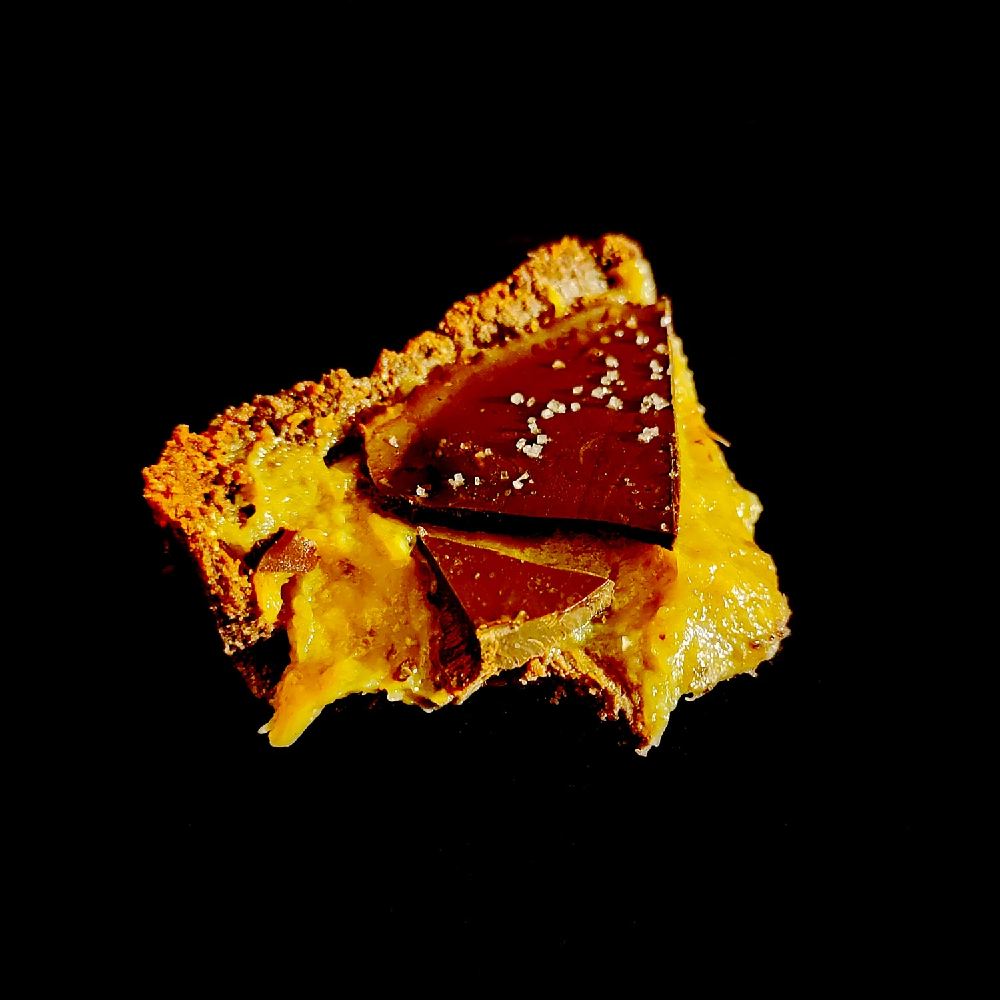

---

layout: recipe
title: "Choco Banana Special (CBS)"
image: choco-banana-special/choco-banana-1.jpg
cuisines: [américaine]
courses: [dessert]
tags: [sans cuisson]
collections: [special]

preptime: 30 min
totaltime: 2 h
yield: 4 portions

storage: 2–3 jours dans une boîte hermétique au frigo.

ingredients:
- 2 bananes mûres écrasées en purée pour la crème de fruit
- extrait de vanille pour la crème de fruit
- 40–50g de chocolat noir pour la coque
- pincée de gros sel

components:
- Cocoa Crust
- Curd de fruit

directions:
- Préparez la crème de banane et faites-la refroidir.
- Tapissez un moule pouvant allant au réfrigérateur de papier cuisson en minimisant au maximum les plis.
- Foncez ensuite la pâte dans votre moule en prenant soin de bien tasser la base et les bords. Les bords doivent être suffisamment hauts pour accueillir la crème banane et la couche de chocolat – après à vous d'adapter les proportions aux différentes étapes du montage si vous voyez que les bords ne le sont pas assez.
- Réservez au frais pendant au minimum 30 minutes, il faut que cette base soit suffisamment solide pour accueillir la crème.
- Fouettez votre crème banane puis versez et distribuez-la dans le fond de la tartelette.
- Réservez au frais pendant 30 minutes.
- Faites fondre votre chocolat au bain marie ou micro-ondes puis laissez le un peu refroidir avant de le verser sur votre crème. Si le chocolat fondu est toutefois trop épais, on peut ajouter quelques gouttes d’huile.
- Lissez la surface en remuant votre moule – on évite la spatule pour ne pas trancher le chocolat. 
- Réservez au frais une dernière fois jusqu’à ce que votre chocolat soit dur.
- Avant dégustation, saupoudrez d’une pincée de gros sel.

---

Les <i lang="en">Specials</i> sont des épiques avec peu d’ingrédients, sans cuisson, et réservés aux <i lang="en">treat days</i> et célébrations. Ils viennent volontier couronner un objectif, progrès, ou plus généralement, tout accomplissement digne d’une tartelette XXL.

Banane et chocolat, un duo iconique qui se revisite en tartelette sans cuisson pour une grande occasion&nbsp;: un biscuit cheesecake au cacao vient accueillir une crème à la banane bien onctueuse, et une coque en chocolat noir vient refermer le tout. Pour une déclinaison encore plus rapide, on peut remplacer la crème banane par une simple purée de bananes mûres écrasées et la coque par une ganache au chocolat. À vous de voir ce que vous préférez.

Pour la crème banane, j’ai utilisé de la farine d’épeautre et du sucre muscovado, mais n’importe quelle autre farine et sucre feront bien évidemment l’affaire. L’idée est de les sélectionner pour ajouter un léger accent à la crème selon vos préférences personnelles e.g. le sucre muscovado apporte une légère note de caramel, qui se marie bien avec l’épeautre.

