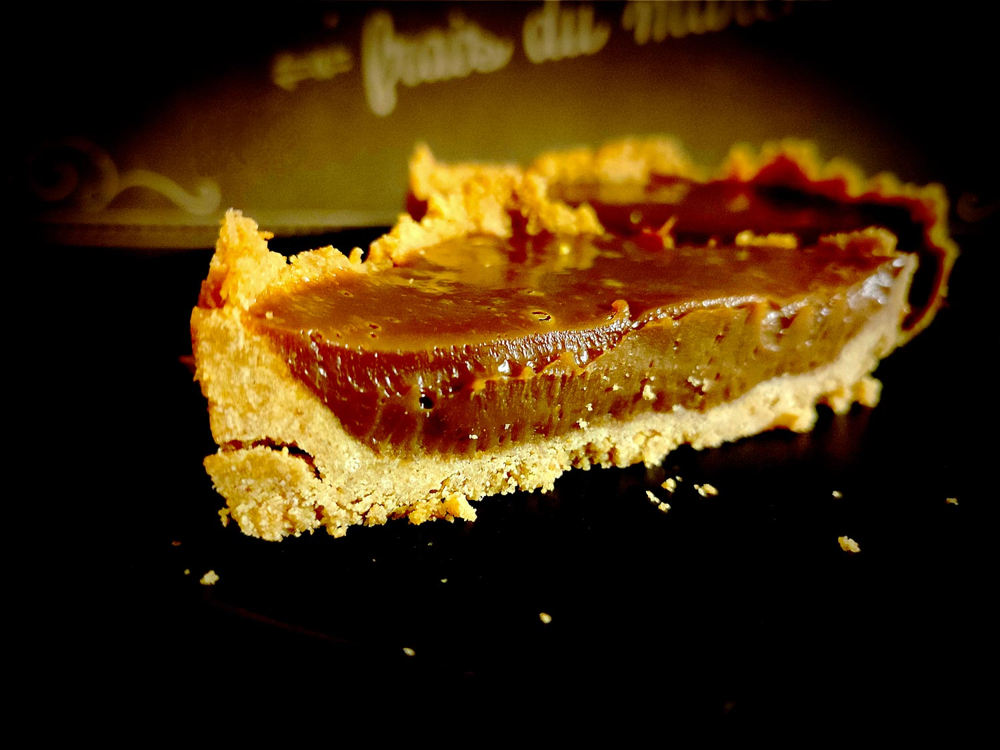

---

layout: recipe
title: "Praliné Special"
image: praline-special/praline-special-1.jpg
cuisines: [américaine]
courses: [dessert]
tags: [sans cuisson]
collections: [special]

preptime: 30 min
totaltime: 2 h
yield: 4 portions

storage: 2–3 jours dans une boîte hermétique au frigo.

components:
- Cheesecake Crust
- Ganache pralinoise

ingredients:
- 1 crust pour cheesecake
- 350g de ganache chocolat pralinoise

directions:
- Tapissez un moule pouvant allant au réfrigérateur de papier cuisson en minimisant au maximum les plis.
- Foncez ensuite la pâte dans votre moule en prenant soin de bien tasser la base et les bords. Les bords doivent être suffisamment hauts pour accueillir la ganache et le glaçage – après à vous d'adapter les proportions aux différentes étapes du montage si vous voyez que les bords ne le sont pas assez. 
- Réservez au frais pendant au minimum 30 minutes, il faut que cette base soit suffisamment solide pour accueillir la ganache.
- Pendant ce temps, préparez la ganache.
- Étalez la ganache pralinoise dans la coque en biscuit.
- Réservez au frais pendant au minimum 1 heure ou jusqu’à ce que la ganache ait bien pris.

---

Les <i lang="en">Specials</i> sont des épiques avec peu d’ingrédients, sans cuisson, et réservés aux <i lang="en">treat days</i> et célébrations. Ils viennent volontier couronner un objectif, progrès, ou plus généralement, tout accomplissement digne d’une tartelette XXL.

Le Praliné Special est une recette en 4 ingrédients qui met en valeur le chocolat pralinoise, tout simplement. Pas de chichi&nbsp;: une crust de cheesecake neutre vient accueillir une généreuse ganache pralinée.

