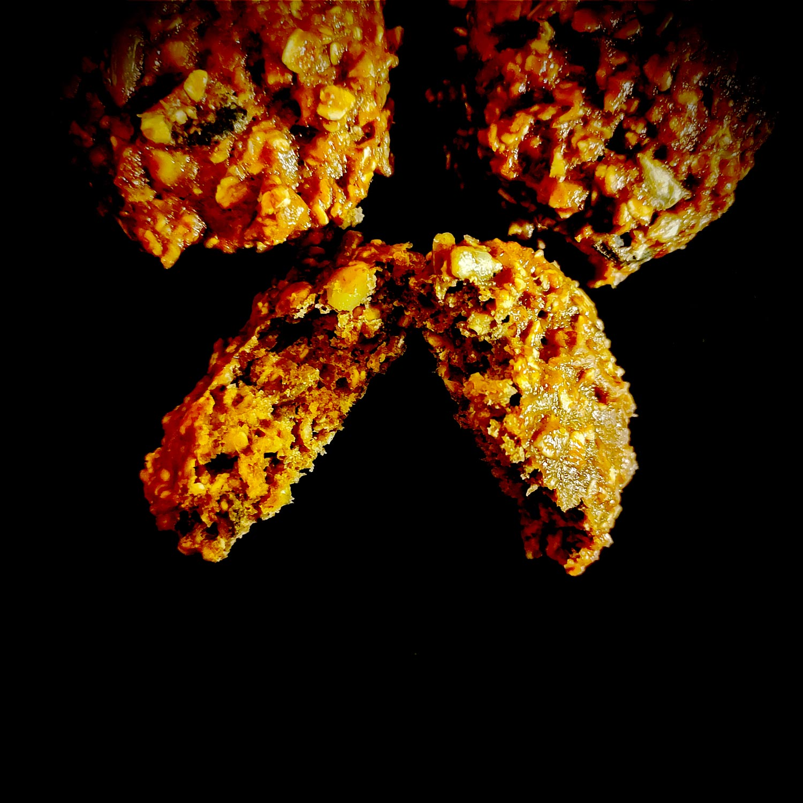

---

layout: recipe
title:  "Banana Cocoats Cookies"
image: banana-cocoats/banana-cocoats-1.jpg
tags: snack, cookie, banane, cacao, graines, avoine, moelleux, healthy

ingredients:
- 120g de farine
- 100g de flocons d’avoine
- 2 bananes mûres
- 1 œuf
- 40g de sucre de canne complet 
- 15g de cacao amer en poudre 
- 50g de mélange de graines
- 1 cuillère à café de levure chimique
- pincée de sel 

directions:
- Écrasez les bananes en purée. Réservez.
- Préchauffez le four à 180°. 
- Dans un bol, battez l'oeuf avec le sucre jusqu'à blanchiment. On ne cherche pas à ajouter de l'air pour amener du volume donc arrêtez-vous des que la mixture a pris une couleur jaune pâle. 
- Ajoutez la banane en purée et mélangez bien.
- Dans un autre bol, tamisez la farine et le cacao amer. Ajoutez les flocons d’avoine et mélangez. Ajoutez la levure et le sel et mélangez une dernière fois.
- Incorporez les ingrédients secs dans le bol des ingrédients humides. On cherche juste à incorporer pour qu'il n'y ait plus de gros grumeau.
- Incorporez et distribuez les graines.
- Déposez des cuillères à soupe de pâte sur une plaque de cuisson. Les cookies ne vont pas énormément s’étaler à la cuisson donc n’hésitez pas à leur donner une belle forme avant d’enfourner. 
- Enfournez pour 15 minutes environ où jusqu’à ce que le dessus revienne lentement dans sa position initiale lorsque l’on appuie dessus.
- Laissez les cookies cuire 5 minutes de plus à température ambiante sur la plaque puis déplacez-les sur une grille de refroidissement. 

---

Banana, cacao, et avoine pour un petit snack “assaini” qui peut se personnaliser. Ici, on ajoute un mélange de graînes mais on peut évidemment parier sur des pépites de chocolat, des fruits secs, etc.

En bouche, on obtient une belle mâche un peu élastique qui donne l’impression de bien se rassasier, d’autant plus qu’on a pas mal de fibres grâce aux flocons d’avoine et graines.

Conservation&nbsp;: 4-5 jours dans une boîte hermétique à l'abri de la lumière et la chaleur. 2–3 mois au congélateur.