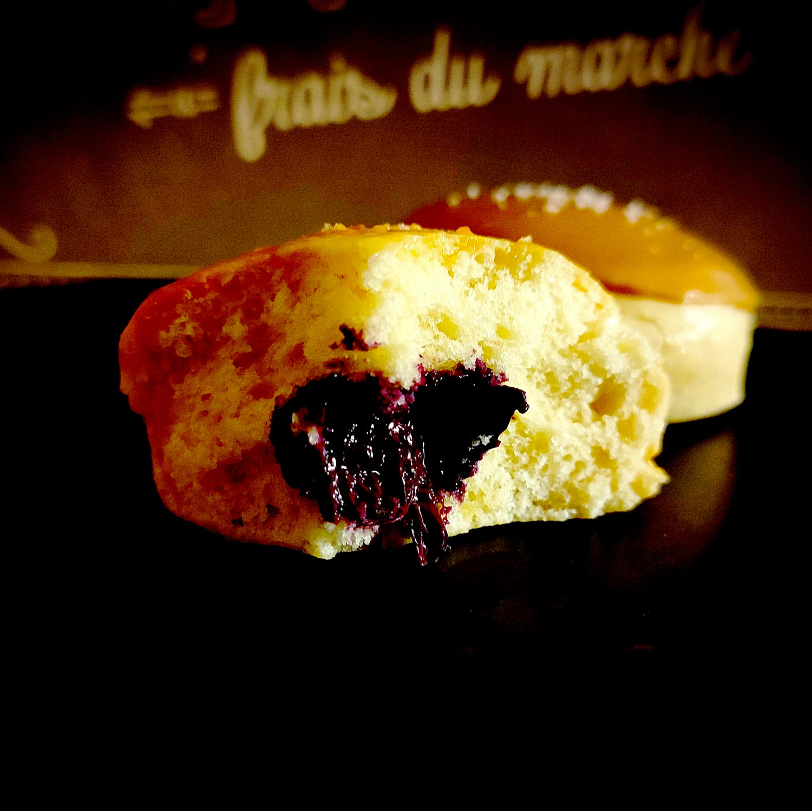

---

layout: recipe
title: "Beignets caramel beurre de myrtilles"
image: beignets-bluebutter/beignets-bluebutter-1.jpg
cuisines: [américaine]
courses: [petit-déjeuner, snack, goûter]
tags: [donut, beignet, boulangerie]

preptime: 40 min
cooktime: 30 min
totaltime: 4 h 40 min
yield: 6–8 beignets (selon l’emporte-pièce)

storage: 2 jours dans une boîte à l’abri de la lumière et de la chaleur. 2–3 mois au congélateur sans glaçage. Pas de frigo car cela va assécher le beignet.

ingredients:
- 200–230g de farine T45–65
- 80–90ml d’eau ou de lait
- 1 œuf 
- 30g de sucre
- 20g de beurre mou
- 1 sachet de levure boulangère sèche
- 150–200g de beurre de myrtilles
- 1 portion de glaçage caramel
- pincée de sel 
- gros sel de Guérande
- lait (+ jaune d’œuf) pour dorure

components:
- Beurre de myrtille
- Glaçage caramel à l’ancienne

directions:
- Si besoin, réhydratez votre levure dans le lait/eau tiède et le sucre.
- Dans un grand bol, mélangez la farine et le sel.
- Ajoutez la levure, le lait/eau tiède, le sucre et l’œuf. Incorporez bien le tout – environ 5 minutes de pétrissage à la main, ou à vitesse lente au robot en raclant les bords si besoin.
- Ajoutez le beurre et rebelotte, 5 nouvelles minutes. La pâte doit rester un peu humide et bien élastique mais ne plus coller aux doigts/parois du bol du robot. Ajustez farine et liquide si besoin.
- Formez une boule.
- Laissez lever la pâte dans un bol huilé et recouvert d’un torchon dans un endroit chaud pendant 1h30–2h – ou au frigo pendant la nuit. Elle devrait avoir doublé de volume au bout de ce laps de temps.
- Sur un plan de travail légèrement fariné, dégazez puis abaissez la pâte au rouleau avec une épaisseur de 1cm.
- Découpez des ronds à l’aide d’un emporte-pièce et déposez-les sur une plaque de cuisson. Nappez-les du lait (mélangé avec un jaune d’œuf) à l’aide d’un pinceau puis recouvrez avec un torchon/du film alimentaire et laissez les beignets reposer pendant 30 minutes.
- Préchauffez le four à 180°C.
- Enfournez pendant 12-18 minutes où jusqu’à ce que l’empreinte d’un doigt se résorbe lentement quand on appuie sur le dessus du beignet.
- Disposez les beignets sur une grille de refroidissement et nappez-les entièrement d’eau frissonnante à l’aide d’un pinceau – pour les aider à conserver leur moelleux plus longtemps. Répétez l’opération quand l’eau a séché.
- Préparez votre beurre de myrtilles.
- Une fois les beignets refroidis, fourrez-les à la poche à douille/seringue.
- Préparez les glaçage au caramel puis nappez le dessus des beignets et disposez-les à nouveau sur la grille.
- Saupoudrez d’une pincée de gros sel.
- Laissez le glaçage se figer – soit à température ambiante soit par un passage rapide au frigo – avant de déguster.

---

Des beignets à cuire au four donc sans le gras de l’huile de cuisson, garnis avec un beurre de myrtilles bien gourmand, et glacés avec un caramel à l’ancienne – réalisé avec du sucre complet. Pour parachever le tout, on vient les saupoudrer d’une pincée de cristaux de sel.

Le résultat est tout doux, bien équilibré au niveau des goûts et, surtout, original par rapport aux beignets à la confiture ou au nutella et leur sempiternel sucre glace, ou au <i lang="en">donut Boston Cream</i> et sa garniture de crème patissière.

Comme d’habitude avec les recettes incluant une levure boulangère, vous pouvez préparer la veille pour laisser pousser toute la nuit au frigo et pouvoir vous lancer directement dans la confection le lendemain matin.

