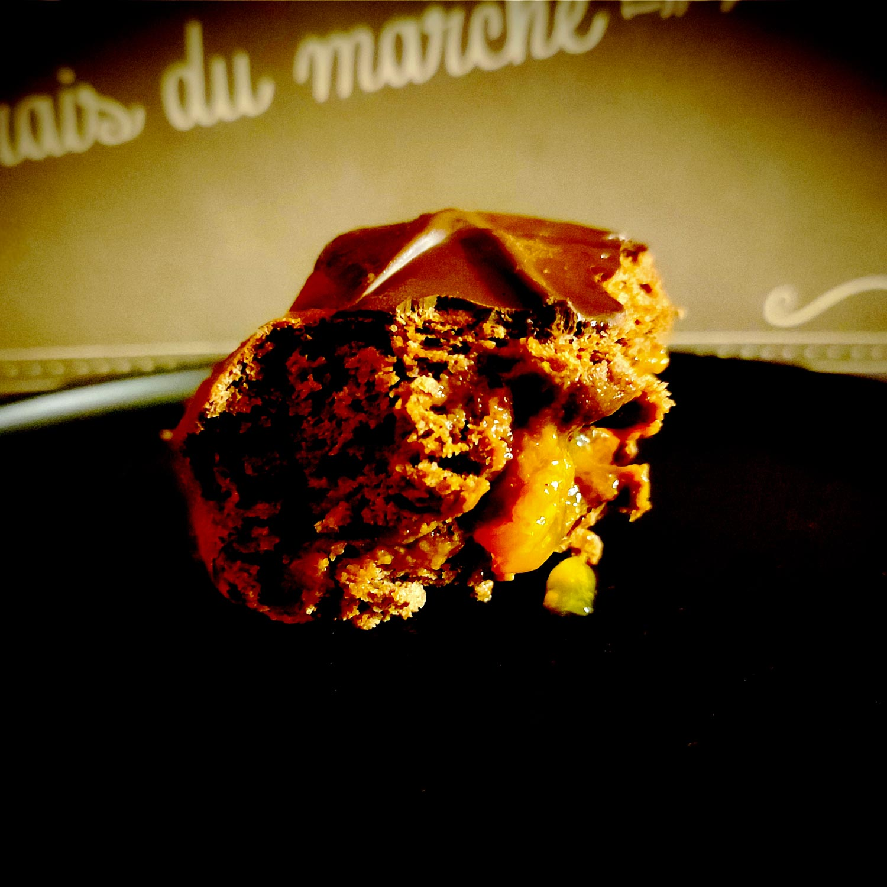

---

layout: recipe
title: "Beignets façon Sachertorte"
image: beignets-sacher/beignets-sacher-1.jpg
tags: snack, beignet, four, donut, sachertorte, cacao, chocolat, abricot, confiture, glaçage levure boulangère, lait, repos, levée, pousse, boulangerie

preptime: 40 min
cooktime: 30 min
totaltime: 4 h 40 min
yield: 6–8 beignets (selon l’emporte-pièce)

storage: 2 jours dans une boîte à l’abri de la lumière et de la chaleur. 2–3 mois au congélateur. Pas de frigo car cela va assécher le beignet.

ingredients:
- 200–230g de farine T45–65
- 100ml d’eau ou de lait
- 1 œuf 
- 30g de sucre
- 20g de cacao amer en poudre non sucré
- 10g de beurre mou
- 1 cuillère à soupe/15ml d’huile d’olive
- 1 sachet de levure boulangère sèche
- pincée de sel
- 200–250g de confiture d’abricot 
- 80g de chocolat noir (prévoir 10g par beignet environ)

directions:
- Si besoin, réhydratez votre levure dans le lait/eau tiède et le sucre.
- Dans un grand bol, mélangez la farine et le cacao en poudre tamisés, et le sel.
- Ajoutez la levure, le lait/eau tiède, le sucre, l’œuf, et l’huile d’olive. Incorporez bien le tout – environ 5 minutes de pétrissage à la main, ou à vitesse lente au robot en raclant les bords si besoin.
- Ajoutez le beurre coupé en petits morceaux et rebelotte, 5 nouvelles minutes. La pâte doit rester un peu humide et bien élastique mais ne plus coller aux doigts/parois du bol du robot. Ajustez farine et liquide si besoin.
- Formez une boule.
- Laissez lever la pâte dans un bol huilé et recouvert d’un torchon dans un endroit chaud pendant 1h30–2h – ou au frigo pendant la nuit. Elle devrait avoir doublé de volume au bout de ce laps de temps.
- Sur un plan de travail légèrement fariné, dégazez puis abaissez la pâte au rouleau avec une épaisseur de 1cm.
- Découpez des ronds à l’aide d’un emporte-pièce et déposez-les sur une plaque de cuisson. Recouvrez avec un torchon/du film alimentaire et laissez les beignets reposer pendant 30 minutes.
- Préchauffez le four à 180°C.
- Enfournez pendant 12-18 minutes où jusqu’à ce que l’empreinte d’un doigt se résorbe lentement quand on appuie sur le dessus du beignet.
- Disposez les beignets sur une grille de refroidissement et nappez-les entièrement d’eau frissonnante à l’aide d’un pinceau – pour les aider à conserver leur moelleux plus longtemps. Répétez l’opération quand l’eau a séché.
- Une fois les beignets refroidis, fourrez-les avec la confiture d’abricot à l’aide d’une poche à douille/seringue.
- Faites fondre le chocolat au bain-marie/micro ondes puis plongez les beignets pour en napper le dessus. Disposez-les à nouveau sur la grille.
- Laissez le glaçage se figer – soit à température ambiante soit par un passage rapide au frigo – avant de déguster.

---

La <i lang="de">Sachertorte</i>, ou tarte Sacher, est un [gateau au chocolat viennois](https://fr.wikipedia.org/wiki/Sachertorte) créé au XIXe siècle. Il est constitué de deux couches de pâte à génoise au chocolat, d'une fine couche de confiture d’abricots entre celles-ci, et d’un glaçage de chocolat noir. 

La recette traditionnelle du gateau n’utilisant aucun agent levant, tout repose sur les blancs battus en neige. Et pour beaucoup de personnes, la confiture d’abricot est un ajout malin et quelque peu nécessaire pour rendre le gateau un peu plus léger – en plus de la crème chantilly qui l’accompagne et du café pour faire passer le tout.

Si notre version beignet utilise une levure boulangère qui devrait donner un résultat un peu plus léger, on n’hésite pourtant pas à bien le garnir de cette même confiture, car c’est ce qui le rend bien humide au cœur, tout doux et réconfortant.

Bien sûr, les beignets à la confiture d’abricot n’ont rien de spécial, on peut même les trouver en pâtisserie industrielle. Mais l’intérêt de cette recette, c’est de jouer à fond la carte de l’association avec le chocolat. Cacao dans la pâte, chocolat noir pour le glaçage. Ça n’a l’air de rien dit comme ça, mais ça change tout.

Comme d’habitude avec les recettes incluant une levure boulangère, vous pouvez préparer la veille pour laisser pousser toute la nuit au frigo et pouvoir vous lancer directement dans la confection le lendemain matin.

