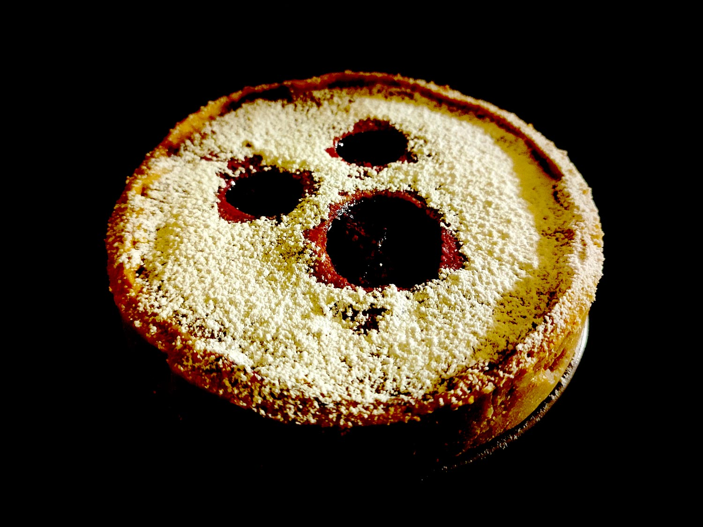

---

layout: recipe
title: "Booberry Pie"
image: booberry-pie/booberry-pie-1.jpg
cuisines: [américaine]
courses: [dessert, goûter]
tags: [Halloween, tarte]

preptime: 45 min
cooktime: 45 min
totaltime: 2 h
yield: 4–6 portions (moule de 14cm)

storage: 2–3 jours dans un conteneur hermétique au frigo.
tip: Pour un effet fantôme encore plus marqué, osez le glaçage au citron ou le glaçage au chocolat blanc. Sinon, saupoudrez simplement de sucre glace juste avant de servir.

components:
- Pâte brisée au yaourt
- Garniture aux myrtilles

ingredients:
- 1 pâte brisée au yaourt
- 1 portion de garniture aux myrtilles
- 1 jaune d’œuf, du lait ou du café pour la dorure
- sucre glace, glaçage, etc. pour la décoration (facultatif)

directions:
- Préparez la pâte brisée au yaourt et réservez-la au frigo.
- Pendant ce temps, préparez la garniture aux myrtilles et mettez-là de côté pour la faire refroidir.
- Préchauffez le four à 180°C.
- Abaissez la pâte avec une épaisseur de 2–3mm et découpez un rond de la taille du moule. À l’aide d’emporte-pièces, découpez 2 petits ronds pour faire les yeux et un plus gros pour la bouche. Réservez.
- Abaissez le reste de la pâte avec la même épaisseur et foncez la pâte dans un moule beurré.
- Piquez le fond et versez la garniture aux myrtilles puis égalisez.
- Prenez la pâte réservée pour le dessus et déposez-la délicatement sur la garniture en prenant soin de bien souder les bords.
- Appliquez la dorure à l’aide d’un pinceau de cuisine sur la pâte du dessus.
- Enfournez pour 30–35 min ou jusqu’à ce que le dessus soit bien doré.
- Dégustez tiède ou froid (si glaçage).

---

Une tarte aux myrtilles à l’américaine, en version Halloween. Évidemment, c’est la <i lang="en">Booberry Pie</i>&nbsp;!

La recette n’est pas forcément la plus compliquée du site avec ses 2 composantes, et le sera encore moins si vous achetez une pâte toute prête. Pour la garniture en revanche, on cherche à conserver les myrtilles entières pour quelque chose de bien gourmand, donc confitures et autres gelées du commerce ne conviendront pas vraiment. 

Pour les plus motivées, ça vaut néanmoins la peine de tout réaliser maison, a fortiori parce qu’on peut personnaliser pâte et garniture avec des notes et accents supplémentaires (amande, cannelle, etc.).

Alors oui, c’est davantage de la décoration qu’une recette à part entière pour Halloween, mais c’est un peu le point commun de la majorité des recettes déclinées pour l’occasion. Rares sont celles conçues uniquement pour cet événement. D’ailleurs, laissez parler votre créativité ici. J’ai créé un “fantôme” avec 2 emporte-pièces et 3 trous mais rien ne vous empêche d’y aller à fond en décorant en relief avec un éventuel reste de pâte brisée, voire d’aller carrément sculpter le visage de ce bon vieux Jack O’Lantern.

