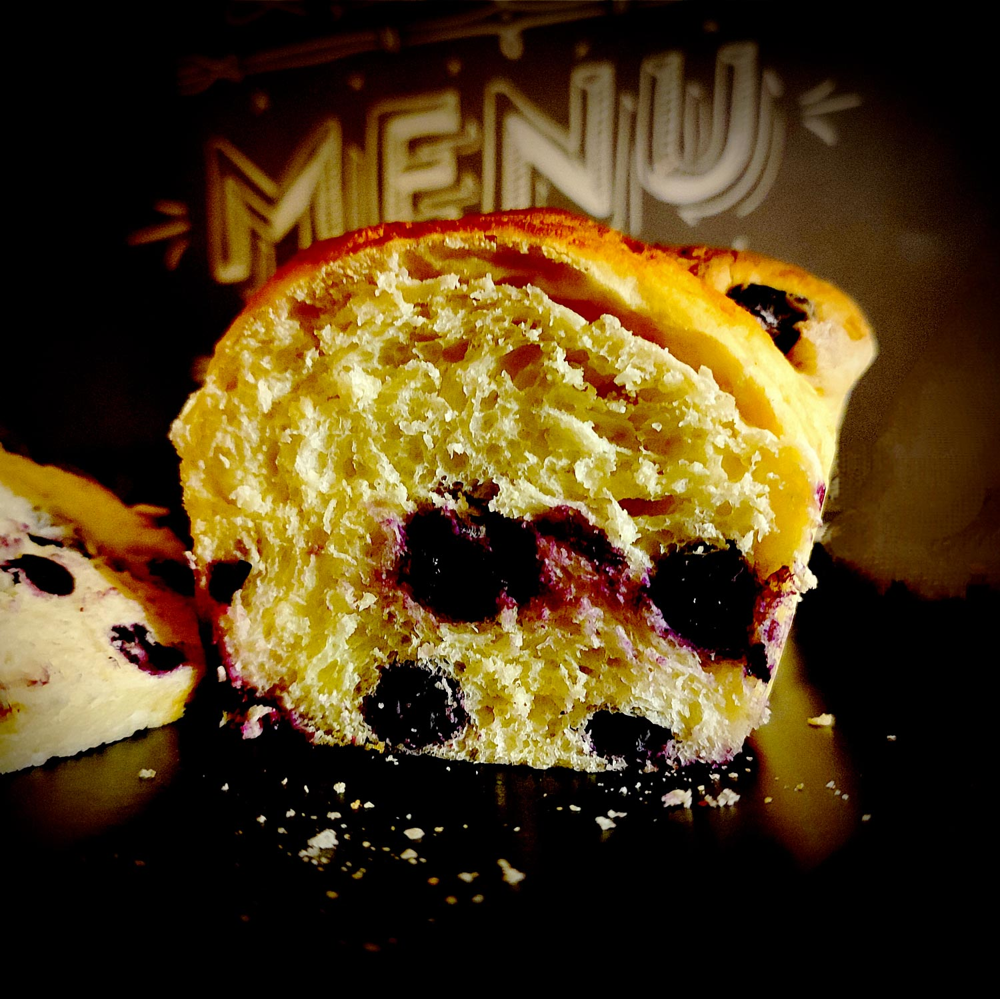

---

layout: recipe
title: "Brioche aux myrtilles"
image: bb-brioche/bb-brioche-1.jpg
cuisines: [française]
courses: [petit-déjeuner, goûter]
tags: [brioche, roll, boulangerie]

preptime: 30 min
cooktime: 35 min
totaltime: 4 h
yield: 12 tranches

storage: 2–3 jours dans une boîte à l’abri de la lumière et de la chaleur à température ambiante. 2–3 mois au congélateur.

ingredients:
- 250g de farine 00 ou T45–65
- 1 sachet de levure boulangère sèche
- 100g de yaourt grec
- 1 œuf
- 50g de lait ou boisson végétale tiède
- 30g de sirop d’érable, d’agave ou de miel
- 1/2 cuillère à café de sel
- extrait de vanille
- 125g de myrtilles
- café refroidi pour dorure

directions:
- Si besoin, réhydratez votre levure dans le lait tiède et le sucre.
- Dans un grand bol, mélangez la farine et le sel.
- Ajoutez l’œuf et pétrissez jusqu’à ce que les ingrédients secs soient bien humides.
- Ajoutez la levure, le lait tiède, l’extrait de vanille, et le yaourt grec. 
- Bien pétrir jusqu'à ce que la pâte soit bien lisse et ne colle quasiment plus aux doigts – au robot, quand la pâte se décolle des parois, pas plus. Elle doit néanmoins rester bien souple, donc ajustez farine et liquide en conséquence. 
- Laissez lever la pâte dans un bol huilé recouvert d’un torchon dans un endroit chaud pendant 1h30–2h. Elle devrait avoir doublé de volume au bout de ce laps de temps. Vous pouvez également la préparer la veille et la laisser lever au frigo pendant la nuit.
- Préchauffez le four à 160°C.
- Sur un plan de travail fariné, dégazez puis abaissez la pâte en un rectangle de 35 cm sur 25 environ.
- Saupoudrez-la de la totalité des myrtilles puis repliez-la sur elle même.
- Abaissez la pâte au rouleau jusqu’à ce que les myrtilles se devinent sous la pâte puis formez un boudin.
- Découpez 6 parts de poids identiques (environ 100g) et formez des boules bien rondes. 
- Placez-les en file indienne dans un moule à cake beurré et fariné.
- Laissez lever 45 minutes à 1 h.
- Nappez le dessus de votre mélange avec du café froid pour dorure. Ne vous inquiétez pas, on ne sentira absolument pas le goût du café
- Enfournez 30 à 35 min où jusqu’à ce que le dessus de la brioche soit bien doré.
- Laissez refroidir la brioche sur une grille avant de déguster.

---

On sait que la combinaison de yaourt grec, de myrtilles et de sirop d’érable/miel fonctionne extrêment bien. Alors pourquoi ne pas l’envisager sous une autre forme&nbsp;? Des petites bulles acidulées lovées dans la mie bien tendre et toute douce d’une brioche, c’est vraiment quelque chose à essayer pour changer des muffins, scones, tartes, crumbles et autres recettes qui viennent instinctivement à l’esprit quand on pense à la myrtille.

Cette brioche toute simple est excellente nature, mais son intérêt est également de pouvoir être personnalisée ou tartinée. Glaçage à la cannelle, à la vanille ou au cacao, pâte à tartiner au chocolat ou beurre de cacahuète, <i lang="en">lemon curd</i> ou confiture de fruits rouges, les options sont en effet nombreuses&nbsp;! Vous pouvez même la tremper dans un chocolat bien chaud pour un goûter ultra réconfortant.

Et ne vous inquiétez pas, on retrouve bien le côté brioche sans huile ni beurre. Le yaourt grec excelle quand il remplace un ingrédient moins <i lang="en">healthy</i> en comparaison, booste la teneur en protéines et apporte une petite note aigre mais onctueuse bien appréciable dans des recettes simples. Il n’y a donc aucune raison de s’en priver.

Astuce&nbsp;: si la brioche a perdu de son moelleux, vous pouvez la passer 15–20 secondes au micro-ondes pour lui faire retrouver toute sa douceur.

