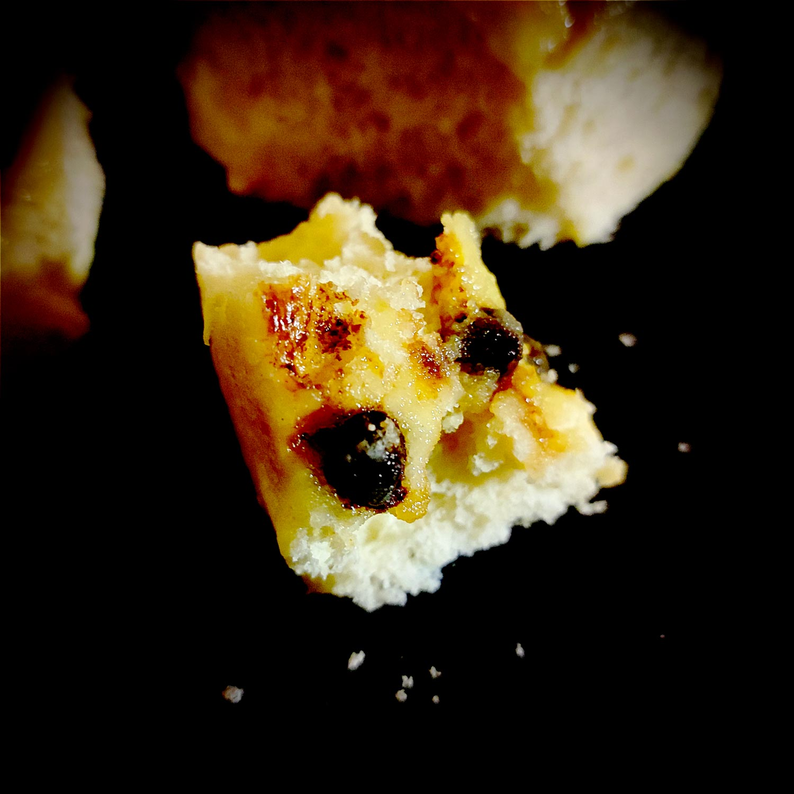

---

layout: recipe
title: "Butchy’s Custard Rolls"
image: butchy-custard/butchy-custard-1.jpg
cuisines: [allemande]
courses: [petit-déjeuner, goûter]
tags: [brioche, roll, boulangerie]

preptime: 45 min
cooktime: 30 min
totaltime: 4 h 15 min
yield: 8 roulés

storage: 2–3 jours dans une boîte à l’abri de la lumière et de la chaleur à température ambiante.

components: 
- Brioche Butchy pour Rolls
- Crème pâtissière
- Glaçage au citron

ingredients:
- 100g de pépites de chocolat

directions:
- Sur un plan de travail fariné, dégazez puis abaissez la pâte en un rectangle de 35 cm sur 25 environ.
- Tapissez-la de la crème pâtissière en prenant bien soin d’égaliser à la spatule, et de laisser un espace des 4 côtés.
- Saupoudrez les pépites de chocolat par dessus.
- Roulez la pâte en un boudin.
- Découpez 8 petits roulés de taille et poids environ identiques – pour une coupe plus nette, utilisez du fil alimentaire. 
- Placez-les côte à côte dans un moule beurré et fariné en laissant un peu d’espace. 
- Laissez lever 45 minutes à 1 h jusqu’à ce que ces espaces soient comblés.
- Préchauffez le four à 160°C.
- Enfournez 25 à 30 min où jusqu’à ce que le dessus des roulés soit bien doré.
- Laissez refroidir la brioche sur une grille avant de la glacer.
- Préparez le glaçage au citron.
- Déversez-le sur le dessus de la brioche pour bien l’imbiber.
- Laissez prendre le glaçage à température ambiante.

---

Des petits roulés briochés à la crème pâtissière et pépites de chocolat. En France, on appelle cela un chinois. Ici, on utilise simplement une pâte à brioche Butchy.

Astuce&nbsp;: si la brioche a perdu de son moelleux, vous pouvez la passer 15–20 secondes au micro-ondes pour lui faire retrouver toute sa douceur.

