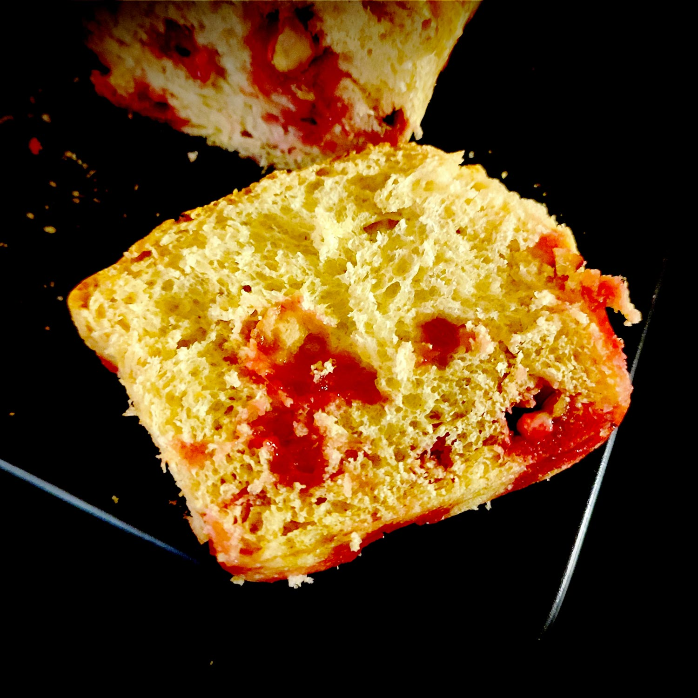

---

layout: recipe
title: "Brioche Butchy’s Genix"
image: butchy-genix/butchy-genix-1.jpg
cuisines: [allemande, française]
courses: [petit-déjeuner, goûter]
tags: [brioche, boulangerie]

preptime: 30 min
cooktime: 35 min
totaltime: 4 h
yield: 12 tranches

storage: 2–3 jours dans une boîte à l’abri de la lumière et de la chaleur à température ambiante. 2–3 mois au congélateur.

ingredients:
- 250g de farine d’épeautre
- 1 sachet de levure boulangère sèche
- 100g de crème fraîche épaisse
- 1 oeuf
- 50g de lait tiède
- 30g de sucre
- 1/2 cuillère à café de sel
- extrait de vanille
- extrait de fleur d’oranger (facultatif)
- 125g de pralines roses concassées
- lait (et jaune d’œuf) pour dorure

directions:
- Si besoin, réhydratez votre levure dans le lait tiède et le sucre.
- Dans un grand bol, mélangez la farine et le sel.
- Ajoutez l’œuf et pétrissez jusqu’à ce que les ingrédients secs soient bien humides.
- Ajoutez la levure, le lait tiède, l’extrait de vanille (et de fleur d’oranger), et la crème fraîche. 
- Bien pétrir jusqu'à ce que la pâte soit bien lisse et ne colle quasiment plus aux doigts – au robot, quand la pâte se décolle des parois, pas plus. Elle doit néanmoins rester bien souple, donc ajustez farine et liquide en conséquence. 
- Laissez lever la pâte dans un bol huilé recouvert d’un torchon dans un endroit chaud pendant 1h30–2h. Elle devrait avoir doublé de volume au bout de ce laps de temps. Vous pouvez également la préparer la veille et la laisser lever au frigo pendant la nuit.
- Préchauffez le four à 160°C.
- Sur un plan de travail fariné, dégazez puis abaissez la pâte en un rectangle de 35 cm sur 25 environ.
- Saupoudrez-la de la moitié des pralines roses concassées puis repliez-la sur elle même.
- Abaissez la pâte à nouveau et répétez l’opération avec la seconde moitié des pralines.
- Abaissez une dernière fois et formez un boudin.
- Découpez 6 parts de poids identiques (environ 100g) et formez des boules bien rondes. 
- Placez-les en file indienne dans un moule à cake beurré et fariné.
- Nappez le dessus de votre mélange pour dorure.
- Laissez lever 45 minutes à 1 h.
- Nappez le dessus de votre mélange pour dorure une seconde fois.
- Enfournez 30 à 35 min où jusqu’à ce que le dessus des boules soit bien doré.
- Laissez refroidir la brioche sur une grille avant de déguster.

---

Une brioche pour l’automne, qui pourra également faire clin d’œil à Octobre Rose pour communiquer sur le dépistage du cancer du sein si c’est quelque chose que vous avez envie de partager autour de vous. 

Inspirée de la brioche Saint-Genix, ou brioche Labully du nom de son créateur, la particularité de cette brioche qui nous vient d’Allemagne, c’est la crème fraîche épaisse qui remplace le beurre. La petite touche en plus sur l’accord des goûts, c’est la combinaison de farine d’épeautre avec l’amande (des pralines roses) pour changer de la farine de blé.

Le résultat sera moelleux, filandreux et aéré, fondant (le sucre rose d’enrobage) et croquant (les amandes) si vous réussissez votre coup, et le tout sans trop de matière grasse par rapport à la recette d’origine – notamment du côté des acides gras saturés, qui sont à limiter. 

Il ne devrait même pas y avoir besoin d’en ajouter puisque le résultat ne devrait pas être sec. Le secret, c’est de pétrir consciencieusement pendant 10 bonnes minutes – et à basse vitesse au robot. La pâte doit rester légèrement collante et montrer une belle elasticité quand on tire dessus. Ensuite, une levure de qualité devrait s’occuper du reste.

Astuce&nbsp;: si la brioche a perdu de son moelleux, vous pouvez la passer 15–20 secondes au micro-ondes pour lui faire retrouver toute sa douceur.

