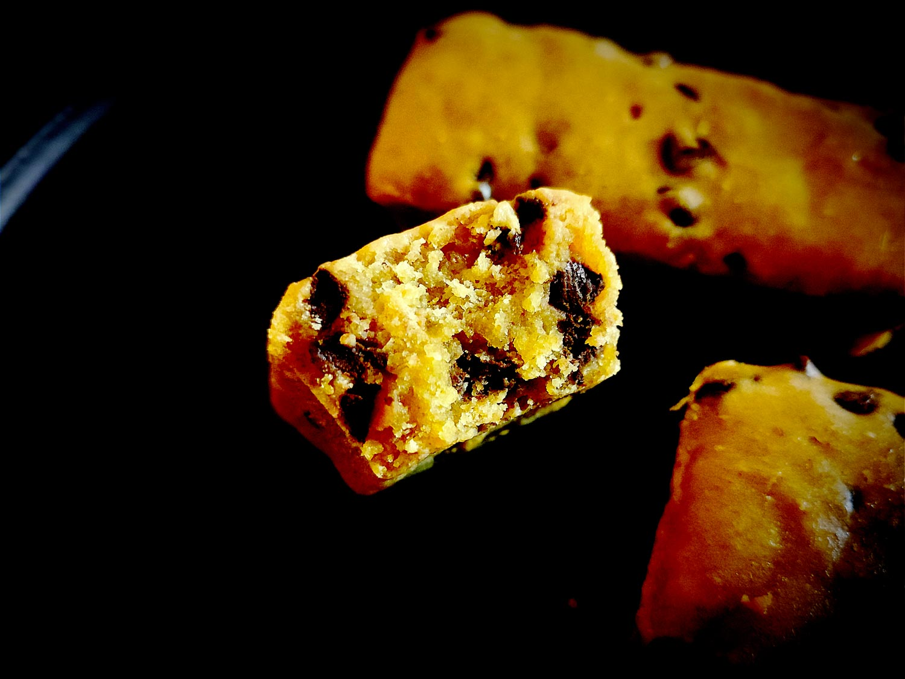

---

layout: recipe
title: "Plumcake dinosaure allo Yogurt"
image: dino-plumcake/dino-plumcake-1.jpg
tags: [snack, moelleux, cake, seigle, nappage, Dinosaurus, yaourt grec, sans beurre]

preptime: 20 min
cooktime: 45 min
yield: 6 mini cakes

storage: 3–5 jours dans une boîte hermétique à l'abri de la chaleur et de la lumière, 2–3 mois au congélateur.

ingredients:
- 90g de farine semi-complète T110
- 30g de farine de seigle
- 30g de fécule de maïs/Maïzena
- 150g de yaourt grec
- 2 œufs
- 60g de sucre de canne complet
- 6cl d’huile neutre
- 2cl d’huile d’olive
- extrait de vanille
- 1 cuillère à café de levure chimique
- ½ cuillère à café de bicarbonate alimentaire
- pincée de sel 
- 60g de pépites de chocolat noir

directions:
- Préchauffez le four à 160°C.
- Blanchissez les oeufs avec le sucre et le sel. 
- Versez l'extrait de vanille et mélangez.
- Ajoutez l'huile petit à petit en continuant à battre. 
- Ajoutez 2 cuillères à soupe des ingrédients secs tamisés et mélangés (farines, levure, bicarbonate, sel) en continuant à battre. 
- Ajoutez le yaourt cuillère à soupe par cuillère à soupe en continuant à battre. 
- Ajoutez le restant des ingrédients secs en continuant à battre. 
- Battez le tout jusqu'à obtenir un résultat parfaitement lisse.
- Incorporez les pépites de chocolat à la spatule/maryse et distribuez-les bien.
- Versez votre pâte dans votre moule à mini cakes.
- Enfournez pour 35–45 minutes. 
- Quand le four commence à embaumer la cuisine d’une bonne odeur de cake et que les plumcakes ont bien gonflé, tenez-vous prêt à tester la cuisson avec un cure-dent/pointe d’un couteau dans les 5 minutes qui suivent. Le bout doit en ressortir propre.
- Laissez refroidir quelques minutes avant de démouler puis déposez-les sur une grille. Ils devraient dégonfler un peu une fois sortis du four.

---

L’intérêt de faire ses propres cakes, c'est aussi de pouvoir créer un produit qui n’existe pas, comme avec ces <i lang="en">plumcakes</i> italiens – c’est une longue histoire que jamais personne n’a su expliquer – dont la pâte est fortement inspirée de biscuits en forme de dinosaures.

On peut entrevoir ces <i lang="en">plumcakes</i> dinosaure comme le croisement entre le quatre-quarts allégé de la cuisine méditérannéenne, et le goût marqué du biscuit au seigle. C’est moelleux, mais fort en goût, mais moelleux, et craquant-fondant avec les pépites de chocolat.

Pour encore plus le marquer, vous pouvez utiliser uniquement de l’huile d’olive au lieu d’un mélange neutre+olive. Et pour rappeler le biscuit, vous pouvez même napper le dessous du <i lang="en">plumcake</i> de chocolat.

