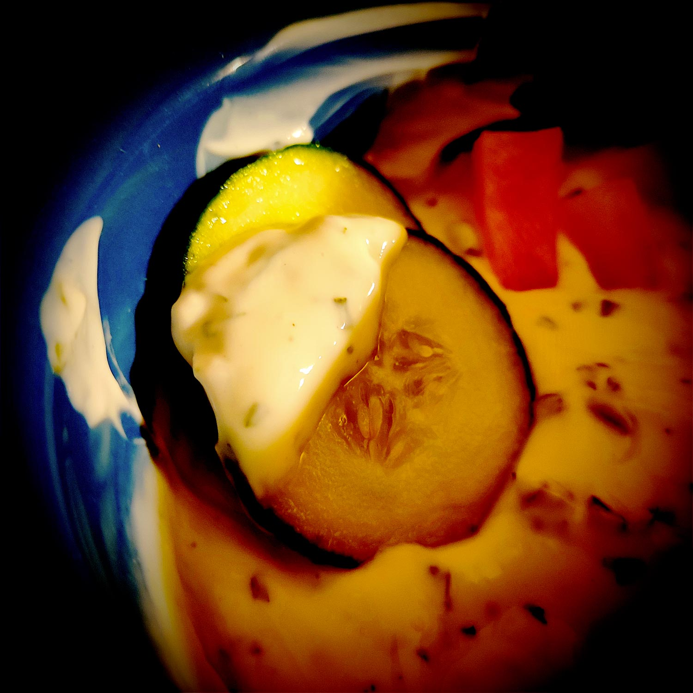

---

layout: recipe
title: "Dip au fromage blanc"
image: dip-fromage-blanc/dip-fromage-blanc-1.jpg
tags: [salade, apéro, dip, accompagnement, fromage blanc, herbes, citron, persil, ciboulette, ail, échalotte, hot sauce, paprika]

preptime: 10 min

storage: 2 jours dans une boîte hermétique au réfrigérateur.

ingredients:
- 100–125g de fromage blanc
- le jus d’½ citron
- 1 gousse d’aïl ou 1 échalote
- Sel
- Poivre
- Persil
- Ciboulette 
- Hot sauce ou paprika (facultatif) 

directions:
- Dans un petit bol battez le fromage blanc puis mélangez avec le jus de citron. 
- Épluchez et émincez l’aïl/échalotte, ajoutez-le dans le fromage blanc et mélangez.
- Ajoutez du sel, du poivre, du persil et de la ciboulette et mélangez bien. 
- Goûtez et ajustez à votre convenance.
- Pour une version relevée, ajoutez quelques gouttes de hot sauce ou un peu de paprika et mélangez une dernière fois. 
- Vous pouvez soit l’utiliser comme un dip, soit vous en servir de sauce pour une salade verte.

---

Une sauce dans laquelle tremper les chips et légumes de l’apéro, mais qui peut également venir napper une belle salade. Rapide à faire avec les aliments du placards à épices, vous pouvez y ajouter à peu près ce que vous préférez comme herbes et même venir la relever un peu.

 