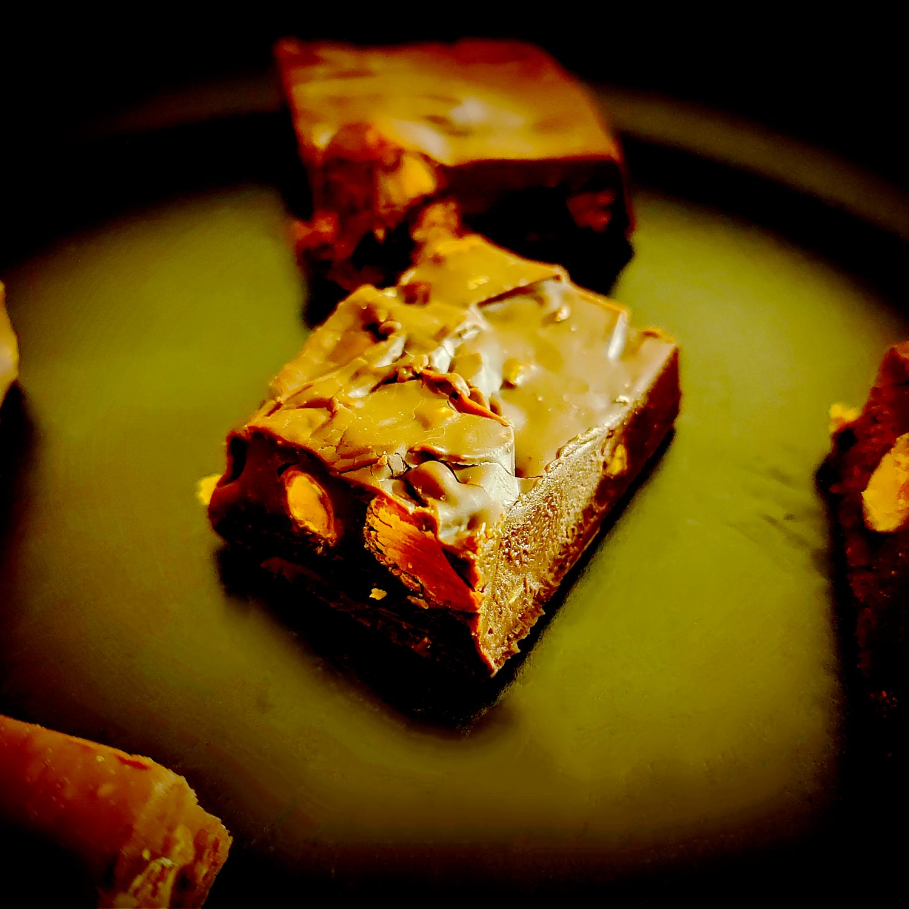

---

layout: recipe
title: "Fudge en 2–2 (express)"
image: fudge-2/fudge-2-1.jpg
tags: snack, chocolat, bouchée, fêtes, noël, sans cuisson, sans four, tablette, lait concentré, lait concentré sucré, micro-ondes

preptime: 5 min
totaltime: 6 h 10 min
yield: 24 bouchées

storage: 2–3 semaines au frigo.

ingredients:
- 200g de chocolat
- 180g de lait condensé sucré

directions:
- Recouvrez un plat à gratin de papier cuisson en laissant du papier en plus sur 2 côtés pour pouvoir le soulever plus facilement. Assurez-vous qu’il puisse aller au frigo.
- Hachez le chocolat en petits morceaux.
- Faites fondre le lait concentré sucré et le chocolat au micro-ondes en plusieurs fois à puissance moyenne, en mélangeant entre chaque itération de 30 secondes. Le but est d’obtenir quelque chose de suffisamment liquide pour pouvoir être coulé et lissé sans galérer avec la maryse.
- Versez le tout dans le plat à gratin, égalisez et lissez.
- Laissez prendre votre fudge pendant au moins 6 heures au frigo.
- Une fois la fudge bien pris, vous pouvez le retirer du plat à gratin et le découper en petits dés.

---

Le <i lang="en">fudge</i> en version classique, [on en a déjà parlé par là](fudge-chocolat.html), mais c’est la version de la flemme ultime, qu’on réalise en 2–2 (2 ingrédients, 2 minutes), qui vous est présentée ici.

Le secret, c’est le lait concentré sucré, une sorte de raccourci par rapport à la recette classique. Donc tant qu’à faire, autant aller taper dans les chocolats aux fruits secs pour utiliser un autre raccourci et obtenir un <i lang="en">fudge</i> fourré, en l’occurrence des pistaches entières et caramélisées. Ça apporte un peu de croquant au fondant, et ça évite d’avoir à s’embêter à les toaster, à trouver les bonnes proportions pour quelque chose d’équilibré à la mâche, etc.

Le plus compliqué dans cette recette, ce sera d’attendre 6 heures le temps que ça prenne. Promis.

