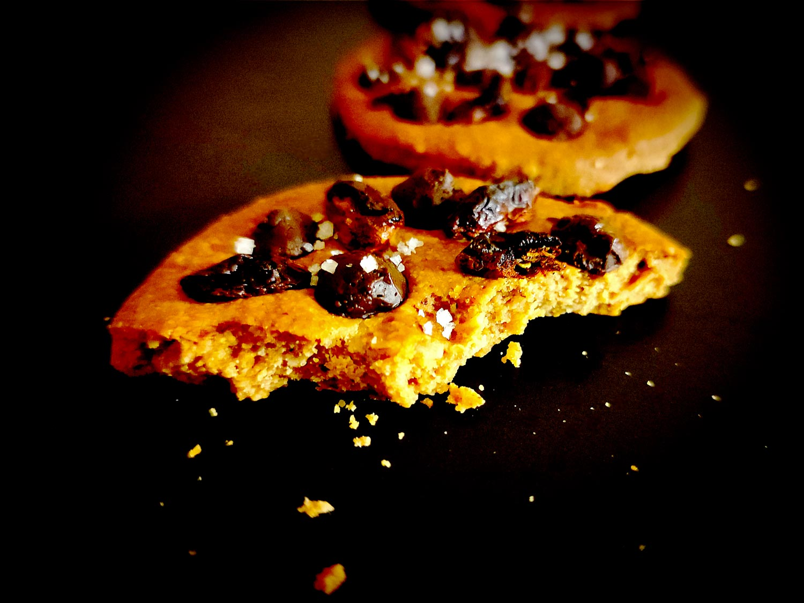

---

layout: recipe
title: "Cookie baies de goji beurre de cacahuète"
image: pb-goji-cookies/pb-goji-cookies-1.jpg
cuisines: [américaine]
courses: [snack]
tags: [cookie, sans œuf, sans beurre, sans huile]
collections: [Peanut Butter]

preptime: 15 min
cooktime: 15 min
yield: 8 cookies de 10 cm

storage: 5–7 jours dans une boîte à biscuits, séparés avec du papier cuisson si besoin.

ingredients:
- 130g de beurre de cacahuète creamy
- 45g de farine d’avoine
- 35ml de sirop d’érable/sirop d’agave
- Extrait de vanille
- 40–50g de baies de goji
- 40–50g de pépites de chocolat noir 70%
- Gros sel

directions:
- Crémez le beurre de cacahuète avec le sirop et l’extrait de vanille. 
- Incorporez la farine d’avoine tamisée jusqu’à ce que vous puissiez former une boule qui se tient. On cherche quelque chose qui se rapproche de la pâte sablée ou du shortbread en un peu plus élastique.
- Si la pâte est trop friable vous pouvez ajouter un tout petit peu de sirop pour corriger la consistance.
- Abaissez grossièrement la pâte, emballez-la dans du film alimentaire et laissez reposer 30 minutes au réfrigérateur
- Préchauffez le four à 180°C. 
- Abaissez la pâte avec une épaisseur d’environ 4–5mm puis découper vos biscuits à l’aide d’un emporte-pièce.
- Disposez les baies de goji et pépites de chocolat sur chaque cookie, puis enfoncez-les légèrement.
- Enfournez pour 12–15 min ou jusqu’à ce que les bords soient légèrement dorés. Surveillez avec attention car les cookies peuvent brunir extrêmement rapidement en fin de cuisson.
- Laissez les cookies sur leur plaque pendant 10 minutes à la sortie du four puis transférez-les sur une grille pour les faire refroidir. Ils devraient durcir en refroidissant.
- Avant dégustation, ajoutez une pincée de gros sel sur chaque cookie.

---

Un cookie gourmand composé de bonnes choses que l’on ne retrouve pas forcément dans les cookies et biscuits traditionnels&nbsp;: du beurre de cacahuète, de la farine d’avoine, et des baies de goji notamment.

On utilise en fait la même base que celle des [cookie sandwiches <i lang="en">fluffernutter</i>](fluffernutter-cookie.html), mais on oublie la crème de marshmallow pour des baies de goji et des pépites de chocolat pour une version légèrement plus saine en terme de macro- et micro-nutriments. On remplace en effet le sucre par les fibres, le calcium, la vitamine C antioxydante, la vitamine A et la bêta-carotène de la baie de goji, et les flavonoïdes du chocolat noir. Et même si les quantités sont mesurées, c‘est toujours mieux.

Ça veut aussi dire qu’on se débrouille avec peu d’ingrédients et que le cookie devient personnalisable à l’envi. Vous n’avez ou n’aimez pas les baies de goji&nbsp;? Eh bien remplacez-les simplement par vos fruits secs ou à coque préférés. On rappelle également qu’on peut même utiliser la pâte comme fond de [tartelette à la crème de melon](tartelette-melon.html)&nbsp;!

