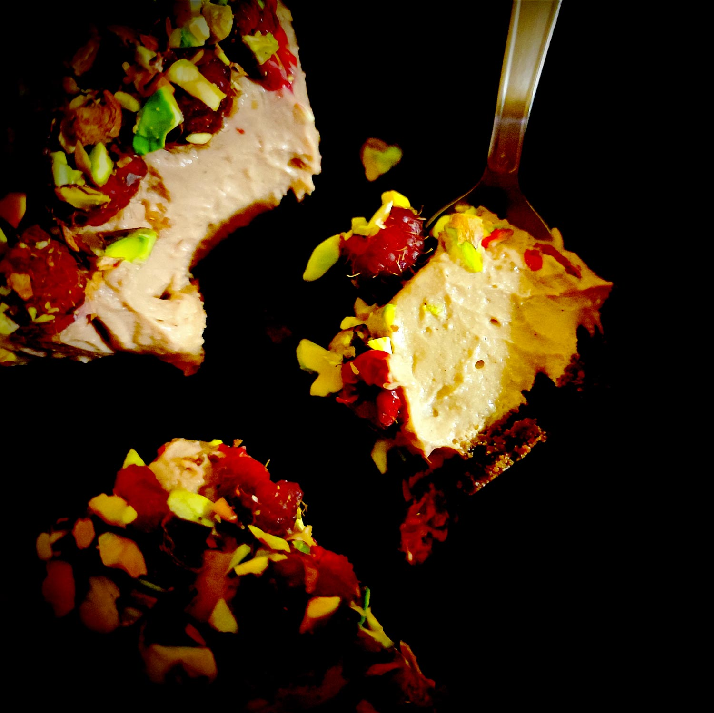

---

layout: recipe
title: "Cheesecake double-cacao, pistaches & framboises"
image: pistachio-raspberry-cheesecake/pistachio-raspberry-cheesecake-1.jpg
tags: cheesecake, sans cuisson, crust, ricotta, mascarpone, sucre glace, sans four, pistache, framboise

components:
- Cocoa Crust

ingredients:
- 1 crust au cacao
- 250g de mascarpone
- 250g de ricotta
- 125g de sucre glace
- 20g de cacao amer en poudre
- 30–40g de pistaches décortiquées
- 100g de framboises
- extrait de vanille
- du gélifiant (facultatif)

directions:
- Tapissez un moule à charnière avec votre crust/pâte sablée, en prenant bien soin de la presser et tasser pour que celle-ci soit compacte et solide après refroidissement.
- Réservez au moins 30 minutes au réfrigérateur pour faire durcir cette base.
- Pendant que votre pâte est au frais, mélangez la ricotta, le mascarpone, et la cacao amer en poudre jusqu’à sa complète intégration. 
- Ajoutez le sucre glace et battez vigoureusement jusqu’à l’obtention d’un appareil bien lisse et aérien.
- Si votre cheesecake ne sera pas consommé en une seule fois, il peut être utile d’ajouter un gélifiant pour assurer sa tenue une fois démoulé, surtout qu’on va ajouter du poids par dessus.
- Retirez votre pâte du réfrigérateur et étalez votre mélange ricotta-mascarpone sur la pâte.
- Remettez le tout au frais pour au moins 2h ou, encore mieux, toute une nuit.
- Avant de servir, concassez les pistaches décortiquées, lavez et essuyez vos framboises
- Démoulez votre cheesecake puis tapissez-en le dessus des framboises. 
- Saupoudrez des pistaches concassées et dégustez.

---

Une recette de cheesecake ricotta-mascarpone sans cuisson avec deux doses de cacao (une dans la <i lang="en">crust</i>, l’autre dans l’appareil), des framboises bien fraîches et des pistaches croquantes.

À la dégustation, vous aurez peut-être même l’impression de croquer des pépites de chocolat plutôt que des pistaches tellement le cheesecake est riche en cacao.

Pas fan du cacao&nbsp;? Essayez plutôt une <i lang="en">crust</i> Speculoos et un appareil à l’extrait d’amande amère.

Conservation&nbsp;: 48 heures au frigo. 1 mois au congélateur mais il faut absolument faire prendre le cheesecake au réfrigérateur avant, on ne peut pas le mettre directement au congélateur.