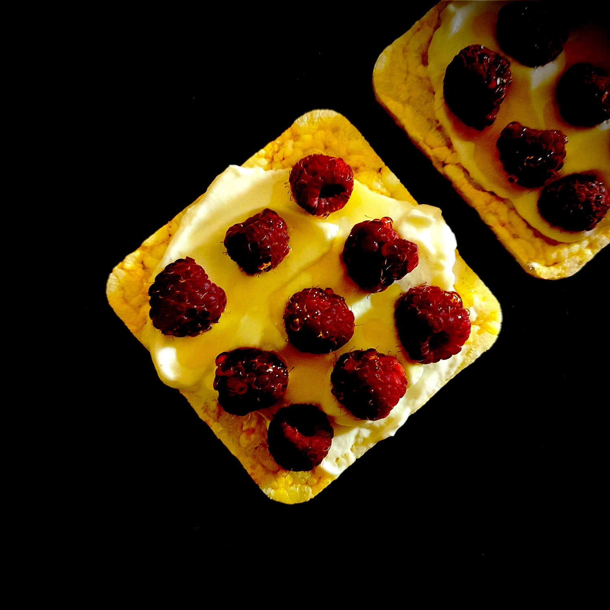

---

layout: recipe
title:  "Raspberry Ricecake"
image: raspberry-ricecake/raspberry-ricecake-1.jpg
tags: [goûter, snack, froid, sans cuisson, framboise, crème, galette de riz, galette de maïs, ricotta, yaourt grec, fraises, miel]

preptime: 5 min
yield: 2 portions

ingredients:
- 4 galettes de riz (ou de maïs)
- 4 cuillères à soupe de yaourt grec/ricotta/crème épaisse
- 125g de framboises
- 1 sachet de sucre vanillé ou du miel (facultatif) 

directions:

- Pour la version “sucre vanillé”, versez les framboises dans un bol, ajoutez-y le sucre, mélangez délicatement pour ne pas abîmer les framboses et laissez macérer jusqu’à ce que le fruit commence à rendre du jus.
- Tartinez une cuillère à soupe de yaourt grec/ricotta/crème sur chaque galette de riz.
- Disposez les framboises par dessus. Faites comme vous sentez pour la quantité, la framboise est l’un des fruits les moins riches en glucides donc quelques framboises en plus ou en moins ne vont pas changer grand-chose. 
- Pour la version “miel”, versez-en un peu en filet sur chaque galette de riz.
- Voilà, votre snack est prêt. Bon appétit!

---

Recette sans prise de tête pour le goûter ou pour snacker. Le <i lang="en">Raspberry Ricecake</i>, c'est comme un <i lang="en">Strawberry Shortcake</i> (fraisier américain), mais en version express à assembler. La galette de riz remplace le gâteau éponge/biscuit/scone, et le yaourt grec la crème fouettée.

Évidemment, rien ne vous empêche d’utiliser des fraises ou d’autres fruits rouges, voire des fruits de saison. L’avantage des framboises, c’est qu’elles sont riches en fibres, ce qui favorise le transit intestinal, augmente la sensation de satiété et, surtout, permet une meilleure régulation de la glycémie – ce qui en font quelque chose de pas mal pour un snack. 

Les fibres, c’est un peu la ligne des valeurs nutritionnelles qu’on oublie beaucoup trop souvent, qui joue les seconds rôles derrières les lipides, glucides, et protéines, mais qui a un impact énorme sur celles-ci. Pensez-y la prochaine fois que vous jetez un œil sur les 3 autres.

