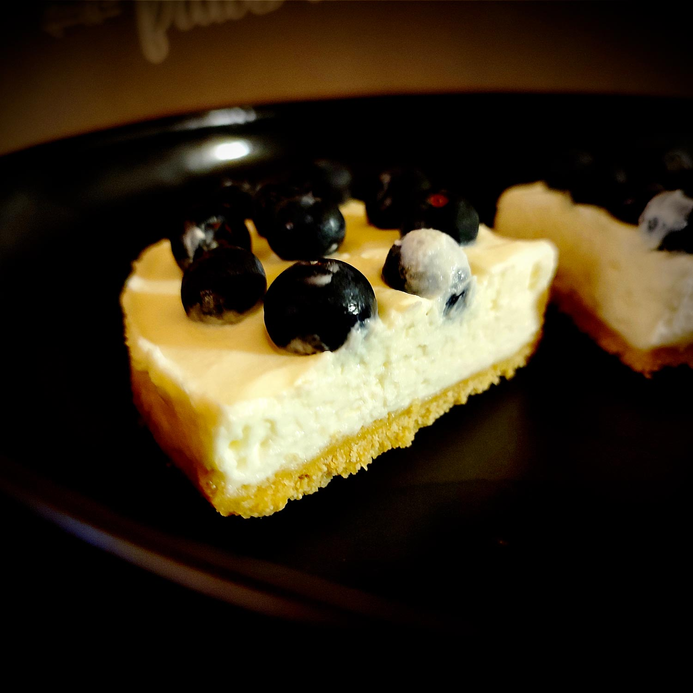

---

layout: recipe
title: "Cheesecake à la ricotta et au mascarpone"
image: ricotta-masc-cheesecake/ricotta-masc-cheesecake-1.jpg
tags: cheesecake, sans cuisson, crust, ricotta, mascarpone, sucre glace, sans four

preptime: 30 min
totaltime: 3 h
yield: 6–8 portions

storage: 48 heures au frigo. 1 mois au congélateur mais il faut absolument faire prendre le cheesecake au réfrigérateur avant, on ne peut pas le mettre directement au congélateur.

components:
- Cheesecake Crust

ingredients:
- 250g de mascarpone
- 250g de ricotta
- 125g de sucre glace
- 6g soit 1 sachet ou 3 feuilles de gélifiant (facultatif)

directions:
- Tapissez un moule à charnière avec votre crust/pâte sablée, en prenant bien soin de la presser et tasser pour que celle-ci soit compacte et solide après refroidissement.
- Réservez au moins 30 minutes au réfrigérateur pour faire durcir cette base.
- Pendant que votre pâte est au frais, mélangez la ricotta et le mascarpone avec le sucre glace. Battez vigoureusement jusqu’à l’obtention d’un appareil bien lisse et aérien.
- Si votre cheesecake ne sera pas consommé en une seule fois, il peut être utile d’ajouter un gélifiant pour assurer sa tenue une fois démoulé, surtout qu’on va ajouter du poids par dessus.
- Retirez votre pâte du réfrigérateur et étalez votre mélange ricotta-mascarpone sur la pâte.
- Remettez le tout au frais pour au moins 2h ou, encore mieux, toute une nuit.
- Ajoutez vos toppings préférés.

---

Par fortes chaleurs, il est utile d’avoir des recettes sans cuisson sous la main. Ça évite d’avoir à allumer le four et, en général, ça demande aussi pas mal moins de travail de préparation – en plus d’éviter le risque de rater la cuisson.

C‘est justement l’idée de cette recette de cheesecake à 5 ingrédients. La base ne change pas, c’est toi qui vient ensuite la personnaliser pour en faire <em>ton</em> cheesecake, avec les ingrédients que tu adores – et il est aussi plus léger que le cheesecake au Philadelphia, qui est une bombe calorique, donc ça offre plus de marge pour pas faire exploser les macros.

