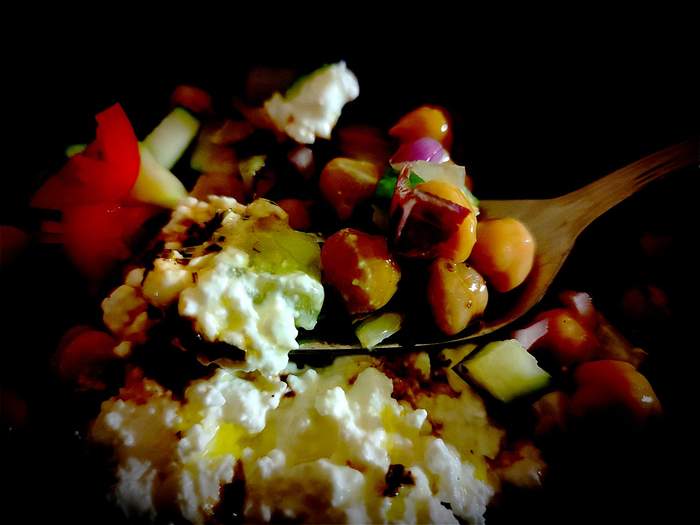

---

layout: recipe
title: "Salade de pois chiches"
image: salade-pois/salade-pois-1.jpg
tags: salade, entrée, plat, accompagnement, pois chiches, vinaigrette, tomates, concombre, été, cottage cheese, protéines, récupération, hydratation

preptime: 20 min
yield: 4 portions

storage: 2–3 jours dans une boîte hermétique au réfrigérateur.

ingredients:
- Pour la salade:
    - 260g de pois chiches (soit une conserve de 400g)
    - 1 concombre 
    - 150g de tomates cerises
    - 1 oignon rouge 
    - 200g de cottage cheese ou de feta (voire du thon)
- Pour la vinaigrette:
    - 3 cuillères à soupe d’huile d’olive 
    - 1 cuillère à soupe de vinaigre balsamique 
    - pincée de sel 
    - poivre 
    - gousse d’ail 
    - persil

directions:
- Faites tremper les pois chiches si besoin puis faites les cuire.
- Préparez la vinaigrette:
    - Épluchez et hachez l’ail très finement.
    - Lavez et hachez le persil.
    - Saler et poivrer le vinaigre dans un bol.
    - Versez progressivement l’huile en fouettant.
    - Ajoutez l’ail et le persil.
- Une fois les pois chiches refroidis, préparez la salade:
    - Découpez le concombre en petits dés.
    - Découpez les tomates cerises en quartiers.
    - Épluchez et hachez l’oignon rouge. 
    - Déversez l’ensemble des ingrédients dans un saladier.
    - Ajoutez le cottage cheese et la vinaigrette par-dessus puis mélangez bien le tout.

---

Une petite salade de pois chiches pour accompagner la récupération après l’effort, avec des protéines végétales (pois chiches) mais également animales (<i lang="en">cottage cheese</i> ou feta, voire même du thon si vous préférez), et des aliments riches en eau histoire de bien se réhydrater.

Évidemment, cette salade peut se préparer à l’avance et se composer d’autres ingrédients, par exemple des légumes de saison ou des alternatives <i lang="en">vegan</i>. On l’accompagne ici d’une vinaigrette, mais rien ne vous empêche de faire une sauce aux herbes et fromage blanc pour apporter l’effet velouté si vous n’avez pas de <i lang="en">cottage cheese</i> sous la main par exemple.

L’astuce&nbsp;: Récupérez le jus de cuisson des pois chiches (aquafaba) pour une autre recette, comme par exemple cette [mousse au chocolat.](mousse-chocofaba.html)

 