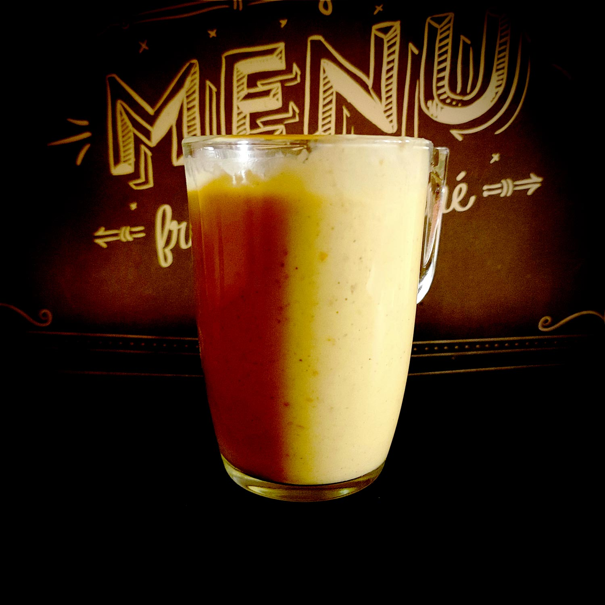

---

layout: recipe
title: "Smoothie protéiné"
image: smoothie-proteine/smoothie-proteine-1.jpg
tags: dessert, snack, smoothie, banane, froid, blender, mixer, sans cuisson, skyr, yaourt grec, fromage blanc, petit suisse, abricot, lait, cannelle, miel

preptime: 10 min
yield: 1 portion

ingredients:
- 1 banane mûre 
- 2 abricots bien froids
- 100g de Skyr, ou de yaourt grec/fromage blanc 0%, ou de Petit Suisse
- 75ml de lait ou boisson végétale
- extrait de vanille
- 1/4 cuillère à café de cannelle
- petite quantité (souhaitée) de miel 

directions:
- Coupez la banane en tranches et ajoutez-les dans le blender.
- Lavez les abricots, coupez-les en quartiers et ajoutes-les dans le blender.
- Ajoutez le yaourt, le lait, et l’extrait de vanille.
- Saupoudrez de cannelle.
- Mixez jusqu’à obtenir une consistance bien lisse.
- Goûtez à la cuillère et ajoutez du miel puis mixez pour sucrer à votre convenance.
- Versez dans un verre et dégustez.

---

Quand on souhaite consommer des protéines sans trop se prendre la tête après une séance de sport, il n’est pas forcément évident d’imaginer faire sans barre ou boisson de récupération ou poudre pour shaker. C’est rapide et pratique, mais ça représente un certain budget et il y a bien sûr les précautions recommandées par les fabricants e.g. conseil médical si la consommation se prolonge sur une durée de plus de 6 semaines, contre-indication en cas d’insuffisance rénale, hépatique et pour les femmes enceintes, etc.

Cette recette de smoothie pourra donc être utile, ne serait-ce que pour changer de temps en temps – on ne va pas se cacher que le goût des aliments protéinés, ça passe ou ça casse.

