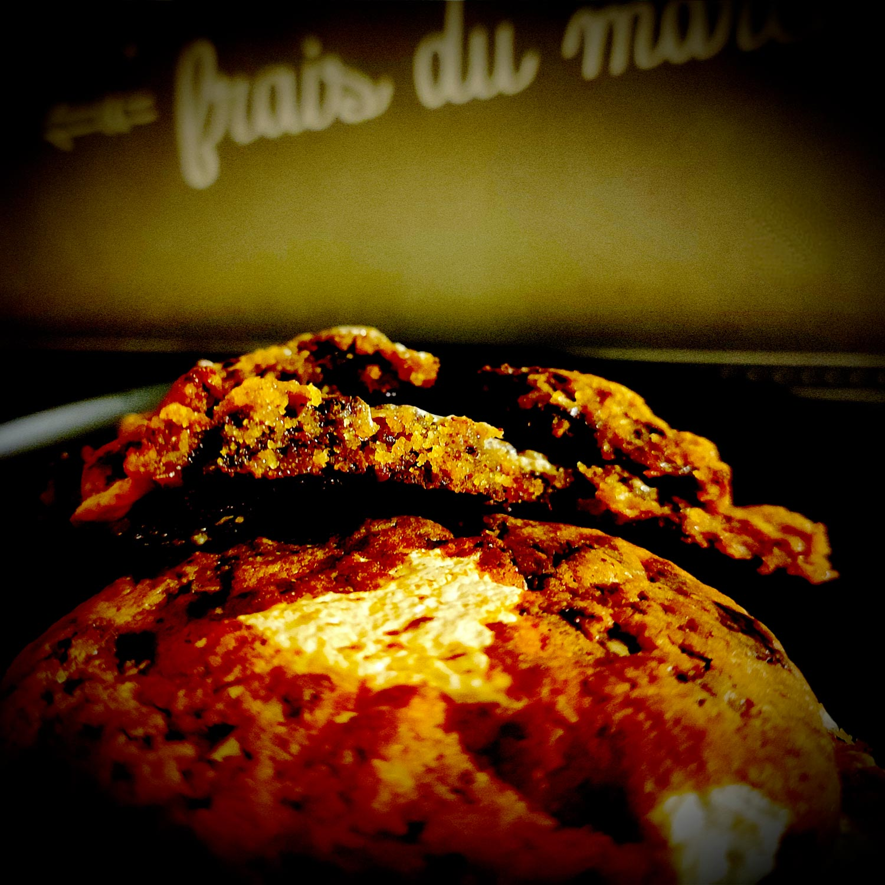

---

layout: recipe
title: "S’more cookies"
image: smore-cookies/smore-cookies-1b.jpg
tags: [cookie, s’more, smore, guimauve, marshmallow, chocolat, snack, croquant, cracker, miel, Graham cracker, chunks, gooey]

preptime: 15 min
cooktime: 15 min
totaltime: 1 h 40 min
yield: 12 cookies

storage: 3–5 jours dans une boîte non hermétique à l'abri de la chaleur et la lumière, en utilisant du papier cuisson ou de l'essuie-tout pour les séparer en étages si besoin. 2–3 mois au congélateur.

ingredients:
- 100g de farine complète T150
- 40g de farine T65
- 75g de beurre mou
- 35g de sucre de canne complet 
- 15g de sucre blanc
- 1 œuf
- 1 cuillère à soupe de miel (soit 20g)
- ¼ cuillère à café de levure chimique
- ⅛ cuillère à café de bicarbonate alimentaire
- Pincée de sel
- Extrait de vanille
- 60g de chocolat
- 24 mini marshmallows ou 12 demi-cuillères à café de marshmallow fluff

directions:
- Si vous utilisez du marshmallow fluff, mettez-le au congélateur pendant 20 minutes afin que celui-ci durcisse un peu. Il sera plus facile à manipuler.
- Hachez le chocolat en gros morceaux et réservez. Prévoyez une quantité de chunks pour la décoration.
- Dans un bol, crémez le beurre avec les deux sucres. 
- Incorporez l’œuf, le miel et la vanille.
- "Dans un autre bol, tamisez et mélangez les ingrédients secs : farines, levure, bicarbonate, et sel."
- Déversez les ingrédients secs et le plus gros des chunks de chocolat dans la crème, et incorporez-les à la maryse en une seule fois, sans trop travailler la pâte.
- Couvrez le bol avec du film alimentaire et réfrigérez la pâte au moins 1heure au frigo – le top c’est de la préparer la veille pour bien réhydrater les ingrédients secs et bien développer les saveurs.
- Préchauffez le four à 180°C.
- Réalisez des boules à l’aide d’une cuillère à glace, et écrasez-les afin de les rendre bien plats et de pouvoir déposer une demi cuillère à café de fluff ou 2 mini marshmallows au milieu. 
- Refermez ensuite la pâte par dessus et formez une nouvelle boule, puis déposez-la sur la plaque de cuisson sans l’écraser ou presque. Les cookies vont facilement s'étaler donc n’hésitez pas à bien les espacer. 
- Parsemez et enfoncez très légèrement des morceaux de chocolat que vous avez réservés pour la décoration sur le dessus de chaque cookie.
- Enfournez pendant 12–15 minutes ou jusqu'à ce que leurs bords soient légèrement dorés. 
- Laissez les cookies 10 minutes sur la plaque à la sortie du four avant de les transférer sur une grille pour refroidissement.

---

Le S’more c'est le snack du feu de camp à 3 ingrédients&nbsp;: un [Graham cracker](https://fr.wikipedia.org/wiki/Biscuit_Graham), un carré de chocolat, et un marshmallow grillé. Le tout se déguste sous forme de sandwich – le cracker est prédécoupé en 2. C'est addictif, d’où son nom, contraction de “<i lang="en">I want some more</i>”, et on refait donc le monde autour en toute décontraction.

C’est une réinterprétation en cookie qui vous est présentée ici, avec une pâte à cookie qui s’inspire du Graham cracker, mais se réalise à l'aide d'ingrédients facilement trouvables en France. Pour le reste, on reste fidèle à la recette d'origine avec une tablette de chocolat découpée en bon gros chunks, et de la guimauve (mini marshmallow ou fluff/crème).

Le défi avec le Graham cracker, c’est que 2 ingrédients sont ultra relous à trouver (voire introuvables) dans nos contrées sans un minimum d'organisation&nbsp;: la farine Graham et la mélasse. Qu’à cela ne tienne, nous allons un peu tricher avec de la farine complète T150 d'un côté&nbsp;; et du sucre de canne complet, qui contient cette fameuse mélasse car il est moins raffiné que le sucre blanc, de l'autre. Dans l’esprit on est pas mal en tout cas – au Royaume-Uni le [biscuit digestive](https://fr.wikipedia.org/wiki/Digestive_biscuit) remplace d’ailleurs le cracker par commodité.

À noter qu’il existe une variante cannelle du cracker. Si vous préférez un léger parfum réminiscent du Spéculoos, ajoutez ½&nbsp;cuillère à café de cannelle en poudre.

 