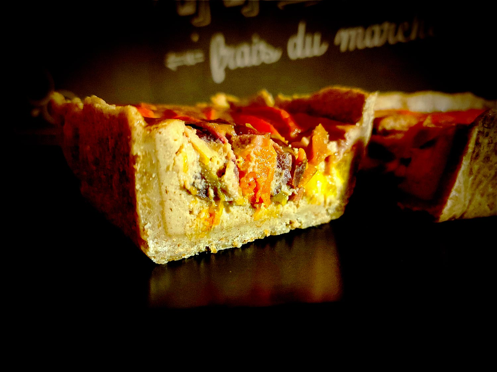

---

layout: recipe
title: "Tarte aux fruits jaunes"
image: tarte-fruits-jaunes/tarte-fruits-jaunes-1.jpg
tags: tarte, pomme, fruit, Dinosaurus, seigle, crème fraîche

preptime: 35 min
cooktime: 35 min
totaltime: 2 h
yield: 6–8 portions

storage: 2 jours au réfrigérateur.

ingredients:
- 1 pâte sablée Dinosaure
- 2 œufs
- 2 abricots 
- 1 pêche jaune
- 1 nectarine jaune
- 100g de fromage blanc
- 85g de purée d’amandes 
- 1 cuillère à soupe de fécule de maïs/Maïzena
- 1 cuillère à soupe de cassonade 
- Extrait de vanille

components:
- Pâte sablée Dinosaure

directions:
- Préchauffez le four à 180°C.
- Abaissez la pâte puis foncez-la dans un moule à tarte. 
- Pas besoin de la piquer. Contrairement à la croyance populaire, c'est en la piquant qu’on risque de la rendre humide avec l'appareil, surtout la crème prise à la cuisson, et pas l'inverse – et c'est Thierry Marx qui l'a découvert avec l'aide du physico-chimiste Raphaël Haumont. Après si vous tenez absolument à piquer, vous pouvez appliquer du blanc d’œuf et la passer 3 minutes au four pour créer une couche d'imperméabilisation.
- Dans un bol, mélangez le fromage blanc avec l’œuf et l’extrait de vanille.
- Mélangez bien votre purée d’amandes – d’autant plus si l’huile s’est séparée – et ajoutez-la à votre appareil. Vous pouvez éventuellement passer le pot de purée d’amandes au micro-ondes pendant 20 secondes pour le rendre plus liquide. Mélangez.
- Ajoutez la fécule de maïs et mélangez pour obtenir un appareil bien lisse. Réservez.
- Coupez les abricots, la nectarine et la pêche en tranches fines. Réservez.
- Versez votre appareil dans votre fond de tarte puis disposez les tranches de fruits par dessus.
- Enfournez pendant environ 20–25 minutes ou jusqu'à ce que l'appareil soit tout juste pris. Pas d’inquiétude si les fruits ont rendu du jus à la cuisson, ce sirop va épaissir en refroidissant sans humidifier la pâte.
- Sortez la tarte du four et saupoudrez de cassonade. 
- Ré-enfournez pour 5–10 minutes ou jusqu'à ce que le sucre ait bien caramélisé. 
- Laissez refroidir avant de démouler. La tarte se mange tiède ou froide. 

---

Une tarte aux fruits jaunes d’été très harmonieuse et équilibrée en goût.

La purée d'amande dans l'appareil, c'est très subtil quand on le goûte comme ça tout seul, mais ça vient enrober les fruits d’un voile tout doux, bien moelleux et harmonieux, sans emphase qui vient casser d'un coup la dégustation, c'est tout juste un accent.

Quant à la nectarine et la pêche, elles viennent trancher l’acidité de abricot et du fromage blanc, tout en apportant une note sucrée qui se suffit à elle-même, pas besoin d’en ajouter dans l’appareil.

Pas de purée d’amandes sous la main&nbsp;? Essayez la compote de pomme.

