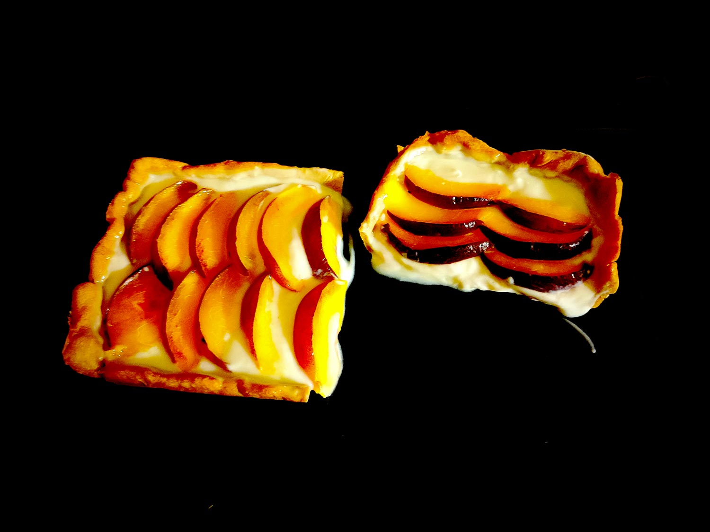

---

layout: recipe
title: "Tarte aux pêches"
image: tarte-peche/tarte-peche-1.jpg
tags: [tarte, miel, fruit, miel, pêche, nappage neutre]

preptime: 35 min
cooktime: 20 min
totaltime: 4 h
yield: 6–8 portions

storage: 2 jours au réfrigérateur.

ingredients:
- 1 pâte brisée épautre caramel
- 2–3 pêches jaunes
- 300g de fromage blanc
- 50g de miel
- 4g soit 2/3 de sachet ou 2 feuilles de gélifiant

components:
- Pâte brisée épeautre caramel

directions:
- Foncez la pâte dans un moule beurré, piquez le fond et réservez au réfrigérateur.
- Préchauffez le four à 180°C.
- Sortez votre moule du réfrigérateur, ajoutez du papier cuisson sur la pâte puis déposez des cailloux ou des billes de cuisson.
- Faites-la cuire à blanc pendant 10–15 minutes.
- Ressortez-la du four, enlevez les billes et le papier.
- Réenfournez pour 5 minutes ou jusqu’à ce que le fond de tarte soit légèrement doré.
- Découpez les pêches en petites tranches. Réservez.
- Réhydratez/réchauffez le gélifiant.
- Fouettez le fromage blanc avec le miel pour obtenir une crème bien lisse.
- Incorporez le gélifiant à l’appareil et assurez-vous de bien mélanger.
- Versez votre appareil dans le fond de tarte et égalisez.
- Déposez les tranches des pêches par dessus.
- Faire prendre l’appareil au moins 2h au frigo.
- Dégustez tiède ou froid en conservant la tarte au frigo.

---

Construite sur le même modèle de la [tarte aux myrtilles](tarte-myrtille.html), cette tarte ne nécessite qu’une cuisson de la pâte à blanc. Ensuite, un appareil au fromage blanc et au miel vient accueillir des tranches de pêches jaunes bien sucrées. 

La magie de cette pâte épeautre caramel c’est qu’elle demande à être imbibée pour la rendre plus humide. Donc même pas besoin de napper le fond de blanc d’œuf pour créer une barrière.

Le fromage blanc se tenant moins bien que la ricotta ou le yaourt grec, il nous faut ajouter un gélifiant dans l’appareil, au risque d’obtenir un appareil trop liquide, comme dans l’image ci-dessous – j’ai oublié. Ça reste très bon mais forcément, c’est plus salissant.

