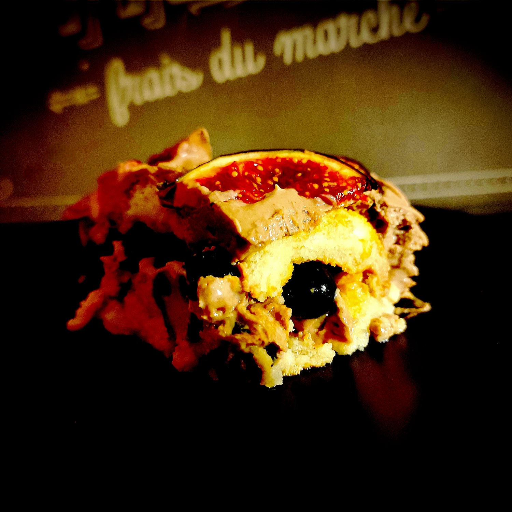

---

layout: recipe
title:  "Tiramisu aux figues et myrtilles"
image: purple-tiramisu/purple-tiramisu-1.jpg
tags: [dessert, froid, sans cuisson, framboise, mascarpone, biscuit cuiller, amande, crémeux]

preptime: 20 min
totaltime: 4 h 20 min
yield: 4 portions

storage: 2 jours au réfrigérateur.

ingredients:
- 2 œufs
- 250g de mascarpone
- 40g de sucre
- 1 cuillère à soupe bombée de cacao amer en poudre
- 10–15 biscuits à la cuillère
- 125g de myrtilles
- 2 figues
- eau sucrée/lait
- extrait d’amande
- extrait de vanille
- pincée de sel

directions:
- Mélangez l’eau sucrée avec l’extrait d’amande puis imbibez légèrement vos biscuits à la cuillère.
- Séparez les blancs des jaunes de vos œufs. 
- Fouettez les jaunes avec le sucre jusqu’à ce que le mélange blanchisse. On ne recherche pas le volume ici, on l’amènera plus tard avec les blancs en neige. 
- Ajoutez l’extrait de vanille et mélangez.
- Ajoutez le mascarpone et fouettez à nouveau.
- Tamisez le cacao et incorporez-le en fouettant. Le résultat doit être bien lisse et homogène.
- Montez les blancs en neige avec la pincée de sel puis incorporez-les en soulevant la masse à la maryse jusqu’à obtenir une crème homogène.
- Lavez et essuyez les myrtilles et les figues.
- Découpez les figues en quartiers (8 par figue).
- Réalisez la première couche de votre tiramisu en déposant les biscuits, puis la crème mascarpone et cacao, et les myrtilles entières.
- Réalisez la seconde couche dans le même ordre, mais avec les quartiers de figues pour finir.
- Laissez prendre au moins 4 heures au frigo
- Avant de servir, agrémentez le dessus de votre tiramisu comme vous le sentez. Il n’y a pas besoin de plus, mais c’est l’occasion d’amener des nuances de goût et contrastes à la mâche donc laissez parler votre imagination.

---

Variante du [tiramisu aux framboises](tiramisu-framboises.html), ce tiramisu au cacao et fruits violets apporte un peu de réconfort et rebooste le mental avant d’attaquer l’automne.

Fruit emblématique de fin d’été, on profite de la figue dans un <i lang="en">pairing</i> qui ne va pas forcément de soi quand on réfléchit à comment l’associer. 

On pense naturellement à la framboise… mais c’est la myrtille, un autre fruit à la peau violette, qui vient apporter un peu d’acidité dans cette recette. Et on la laisse entière plutôt que de la mixer pour apporter du peps à la mâche et contraster avec le crémeux du mascarpone et le moelleux des biscuits cuillère.

