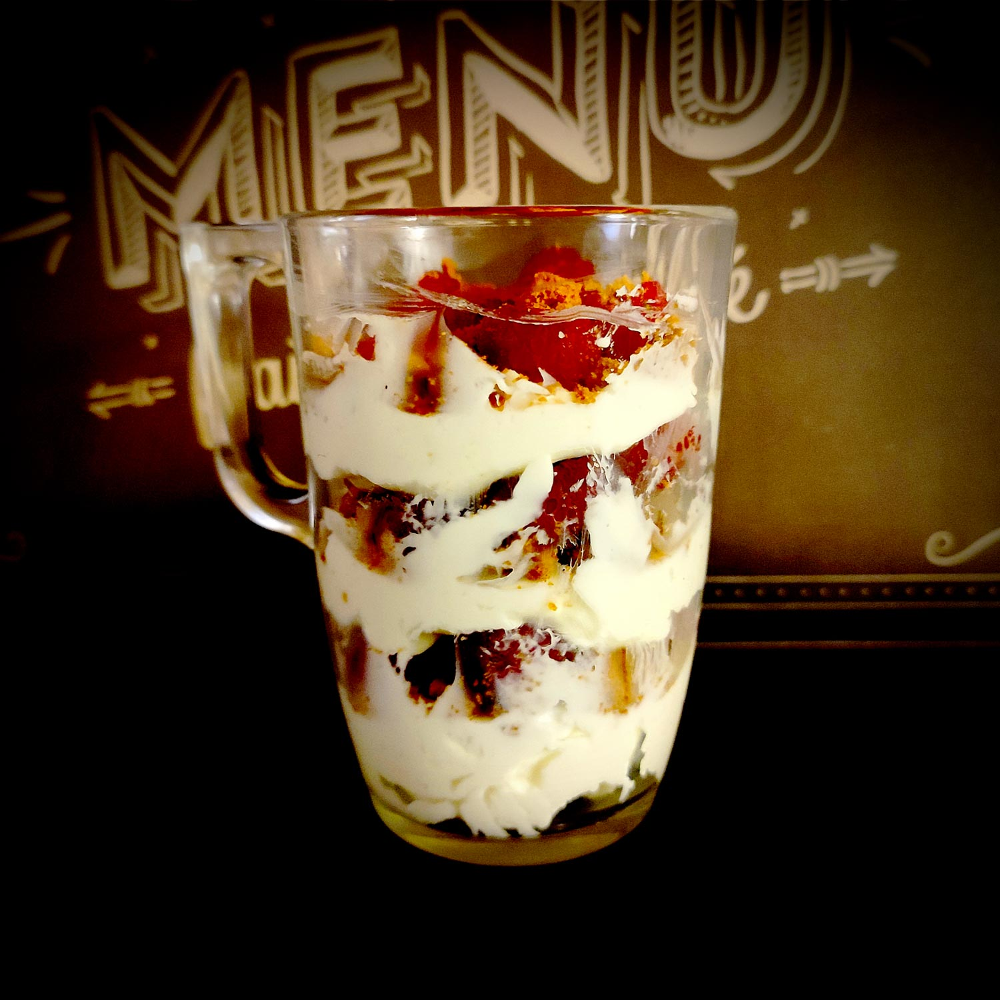

---

layout: recipe
title:  "Tiramisu en verrine"
image: tiramisu-verrine/tiramisu-verrine-1.jpg
cuisines: [italienne]
courses: [dessert, goûter]
tags: [sans cuisson, tiramisu]

preptime: 10 min
yield: 2 portions

storage: 2 jours au réfrigérateur.

ingredients:
- 125g de mascarpone
- 50g de sucre glace
- 125g de framboises 
- 6 biscuits Spéculoos
- 1 cuillère à café d’extrait de vanille ou d’amande

directions:

- Écrasez les biscuits en petits morceaux dans un sac congélation à l’aide d'un rouleau à pâtisserie ou d’un verre/bol puis réservez.
- Fouettez vigoureusement la mascarpone avec la vanille/amande et le sucre glace pendant 3–4 minutes ou jusqu’à obtenir une crème bien lisse. 
- Déposez 1 cuillère à soupe de crème au fond de la verrine, puis 1 de biscuits émiettés, puis ajoutez quelques framboises par dessus. Répétez l’opération jusqu’à épuisement de la crème. 
- Vous pouvez déguster la verrine de suite ou la réserver au réfrigérateur. 

---

Une recette de <i lang="en">tiramisu</i> express en verrine, et qui peut donc se préparer à la dernière minute puisqu’elle ne demande aucun temps de repos au réfrigérateur.

Le tout se compose avec peu d’ingrédients et peut se décliner avec ce que vous avez sous la main. On utilise des framboises ici, mais on pourrait également utiliser des myrtilles, abricots, pêches, etc. sans rien changer par ailleurs.

À vous de jouer&nbsp;!

