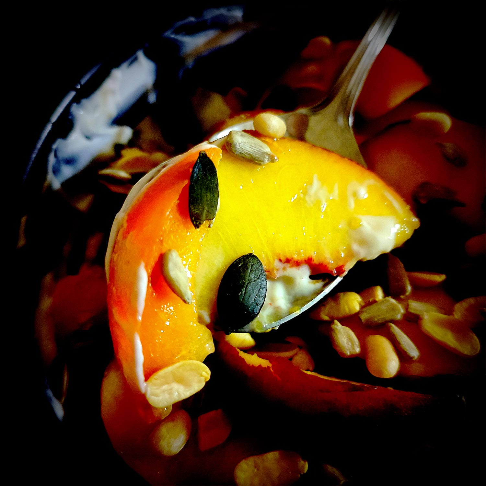

---

layout: recipe
title: "Yaourt aux fruits jaunes"
image: yaourt-fruits-jaunes/yaourt-fruits-jaunes-1.jpg
tags: [yaourt, grec, fruits jaunes, abricot, pêche, miel, nectarine, graines, sans cuisson]

preptime: 5 min
yield: 2 portions

ingredients:
- 150g de yaourt grec 0%
- 2 abricots 
- 1 pêche jaune 
- 1 nectarine jaune
- 5g de miel/sucre de canne complet
- 1 cuillère à soupe de mélange de graines  

directions:
- Dans un bol, versez le yaourt grec et le miel/sucre puis fouettez pour obtenir une crème bien lisse.
- Lavez et découpez vos fruits en quartiers puis disposez-les sur le yaourt.
- Saupoudrez les graines et dégustez.

---

Un snack super rapide pour le goûter, avec du yaourt grec et des fruits de saison. On prend simplement soin d’amener un peu de croquant avec un mélange de graines (tournesol, courge, etc.) histoire de le rendre plus gourmand et intéressant – et ça amène du bon gras et des protéines en plus.

