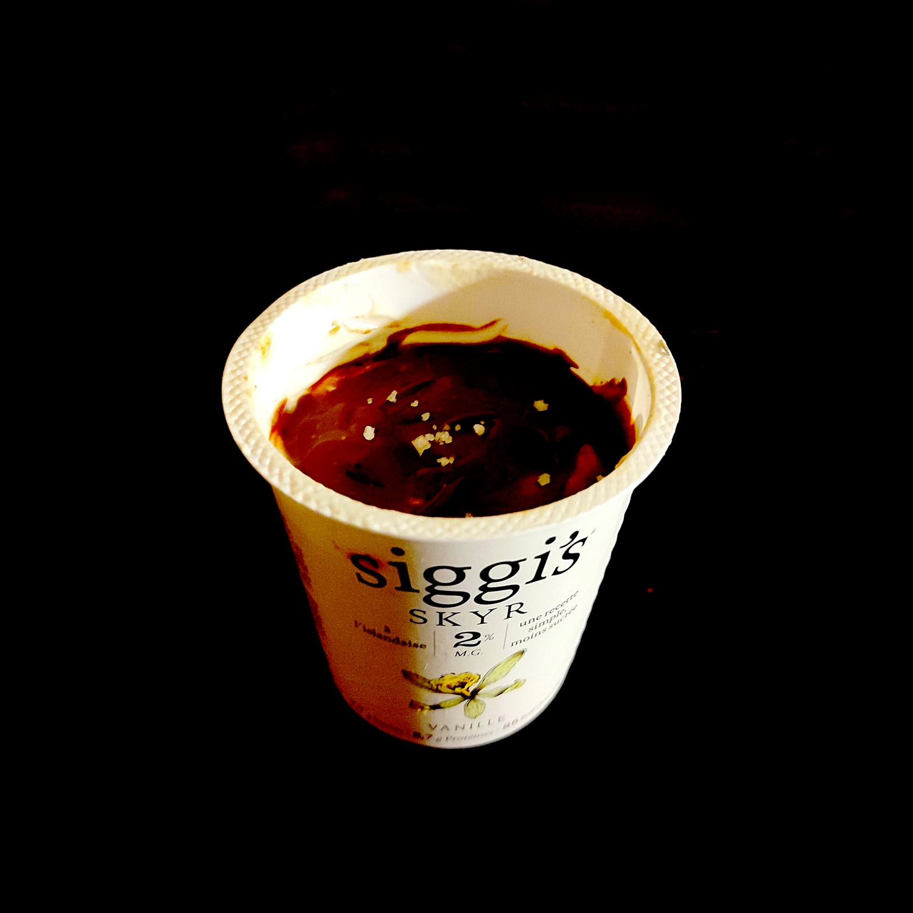

---

layout: recipe
title: "Yaourt glacé façon Snickers"
image: yaourt-snickers/yaourt-snickers-1.jpg
cuisines: [américaine]
courses: [dessert, snack]
tags: [3 ingrédients, glacé]

preptime: 5 min
totaltime: 25 min
yield: 1 portion

ingredients:
- 1 pot/140–150g de yaourt grec ou skyr vanille
- 1,5 cuillère à soupe de beurre de cacahuète crunchy
- 2 carrés de chocolat 
- une mini pincée de fleur de sel

directions:
- Mélangez le beurre de cacahuète directement dans le pot de yaourt.
- Faites fondre le chocolat et nappez le dessus du yaourt. 
- Congelez pour 15-25 minutes, le temps que la couche de chocolat et le yaourt durcissent. 
- Saupoudrez d’une mini pincée de fleur de sel.
- Dégustez de suite en éclatant bien la coque de chocolat.  

---

Une fois n’est pas coutume, une recette “à la mode” [postée un jour sur TikTok](https://www.tiktok.com/@ambitiouskitchen/video/7234652993780698414), qui a fait la renommée de AmbitiousKitchen, puis a été récupérée par tous les influenceurs <i lang="en">snacking</i> du monde. Et pour cause, ça dépanne bien quand on a envie d’un petit snack – bien protéiné pour le coup, ce qui ne gâche rien – et c’est ultra rapide à préparer. Le plus long c’est d’attendre, en fait.

On utilise un raccourci dans cette recette en utilisant l’ingrédient 2–en-1 qu’est le beurre de cacahuète crunchy – beurre de cacahuète + éclats de cacahuète. Mais vous pouvez remixer le concept avec d’autres ingrédients pour recréer les goûts que vous préférez, bien évidemment&nbsp;!

Attention, on parle de la barre glacée Snickers, qui a un goût particulier, et pas de la barre chocolatée de base.

